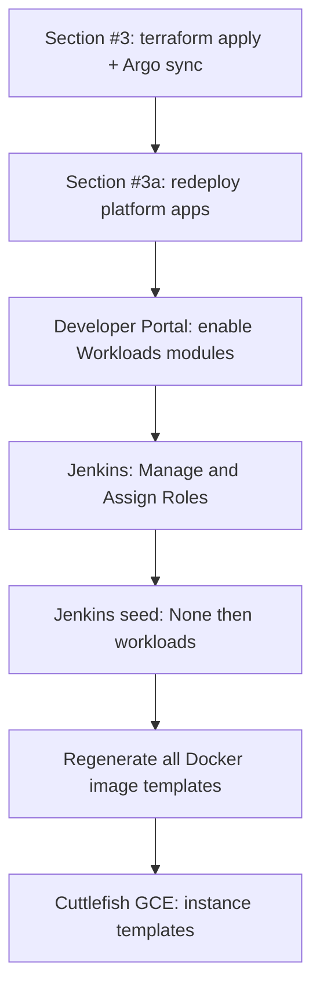

<!-- Copyright (c) 2026 Accenture, All Rights Reserved.

Licensed under the Apache License, Version 2.0 (the "License");
you may not use this file except in compliance with the License.
You may obtain a copy of the License at

        http://www.apache.org/licenses/LICENSE-2.0

Unless required by applicable law or agreed to in writing, software
distributed under the License is distributed on an "AS IS" BASIS,
WITHOUT WARRANTIES OR CONDITIONS OF ANY KIND, either express or implied.
See the License for the specific language governing permissions and
limitations under the License. -->

# Upgrade Guide: 4.0.0 to 4.1.0

This guide explains how to upgrade an existing Horizon SDV 4.0.0 environment to 4.1.0.

## Table of Contents

- [Overview](#overview)
- [Prerequisites](#prerequisites)
- [Configuration Placeholders](#configuration-placeholders)
- [Section #1 - Update the Repository](#section-1---update-the-repository)
- [Section #2 - Align terraform.tfvars](#section-2---align-terraformtfvars)
  - [Section #2a - GKE release channel and maintenance](#section-2a---gke-release-channel-and-maintenance)
  - [Section #2b - ARM64 Cuttlefish placement](#section-2b---arm64-cuttlefish-placement)
- [Section #3 - Run the Deployment Script](#section-3---run-the-deployment-script)
  - [Section #3a - Redeploy platform applications](#section-3a---redeploy-platform-applications)
  - [Section #3b - Workload upgrades (release checklist) - CI/CD](#section-3b---workload-upgrades-release-checklist---cicd)
- [Section #4 - Verification](#section-4---verification)
- [Related documentation](#related-documentation)

---

<a id="overview"></a>

## Overview

Release 4.1.0 adds Terraform-driven configuration for **GKE maintenance policy** and **ARM64 Cuttlefish networking/placement**. Most environments need to **review and update `terraform.tfvars`** (using `terraform/env/terraform.tfvars.sample` as the reference) before `terraform apply`.

| Change | Action required |
|--------|-----------------|
| GKE release channel, recurring maintenance window, maintenance exclusions | [Section #2a](#section-2a---gke-release-channel-and-maintenance); optional two-step apply when enabling release channel + `NO_MINOR_*` exclusions |
| ARM64 region, zone, subnet via GitOps (`config.arm64`) | [Section #2b](#section-2b---arm64-cuttlefish-placement); **rebuild ARM64 instance templates** after placement changes ([Section #3b](#section-3b---workload-upgrades-release-checklist---cicd)) |
| Platform app redeploy (`module-manager`, `horizon-dev-portal`, `horizon-api`) | [Section #3a](#section-3a---redeploy-platform-applications) after [Section #3](#section-3---run-the-deployment-script) |

**Defaults if you change nothing:** GKE stays on `sdv_cluster_release_channel = "UNSPECIFIED"` (same static behaviour as 4.0.0). **ARM64:** See [Section #2b](#section-2b---arm64-cuttlefish-placement) — **brownfield** for existing 4.0.0 dedicated subnet, **greenfield** for new, two applies to switch.

---

<a id="prerequisites"></a>

## Prerequisites

Before starting the upgrade:

- The **4.0.0 environment is fully deployed and healthy**. Argo CD applications should be `Synced` and `Healthy`.
- You have reviewed **`terraform/env/terraform.tfvars.sample`** and aligned **`terraform/env/terraform.tfvars`** with the 4.1.0 variables and comments in that sample ([Section #2](#section-2---align-terraformtfvars)).
- You can run the deployment workflow (`container-deploy.sh` or `deploy.sh`).
- You have Argo CD admin access for [Section #3a](#section-3a---redeploy-platform-applications) (credentials: [Deployment Guide — Homepage not reachable](../deployment_guide.md#section-6f---homepage-not-reachable-after-deployment)).
- **Keep enabled modules as-is during upgrade.** 4.1.0 aligns unpinned modules to the platform Git ref when `module-manager` restarts after apply — disabling all modules first is unnecessary and causes extended downtime.
- For ARM64 Cuttlefish placement changes: plan time for [Section #3b](#section-3b---workload-upgrades-release-checklist---cicd) (Portal modules if needed, **Seed Workloads**, rebuild ARM64 instance templates).

---

<a id="configuration-placeholders"></a>

## Configuration Placeholders

| Placeholder | Description | Example |
|-------------|-------------|---------|
| `SUB_DOMAIN` | Environment subdomain (`sdv_env_name` in tfvars) | `sbx` |
| `HORIZON_DOMAIN` | Root domain (`sdv_root_domain` in tfvars) | `example.com` |

---

<h2 id="section-1---update-the-repository">Section #1 - Update the Repository</h2>

Check out the 4.1.0 release branch and pull the latest changes.

```bash
git fetch origin
git checkout <BRANCH_NAME>
git pull
```

---

<h2 id="section-2---align-terraformtfvars">Section #2 - Align terraform.tfvars</h2>

Release 4.1.0 changes fall into two areas in **`terraform/env/terraform.tfvars`**. Open **`terraform/env/terraform.tfvars.sample`** and align **`terraform/env/terraform.tfvars`** with the blocks below. Apply both sections in a single `terraform apply` unless [Section #2a](#section-2a---gke-release-channel-and-maintenance) calls for a two-step apply.

<h3 id="section-2a---gke-release-channel-and-maintenance">Section #2a - GKE release channel and maintenance</h3>

In **`terraform/env/terraform.tfvars.sample`**, see the **`# GKE cluster`** comment block and the related **`sdv_cluster_*`** variables below it.

New or clarified variables include:

- `sdv_cluster_version` — control plane minimum version (floor)
- `sdv_cluster_release_channel` — `UNSPECIFIED`, `RAPID`, `REGULAR`, `STABLE`, or `EXTENDED`
- `sdv_cluster_maintenance_recurring_window_*` — when maintenance may run
- `sdv_cluster_maintenance_exclusions` — optional upgrade deferrals

> [!IMPORTANT]
> **`EXTENDED` and Config Connector:** GKE does not allow the Config Connector add-on on `EXTENDED` clusters. This repo enables that add-on by default. Do not set `EXTENDED` without reading the sample comments and planning a change.
>
> **Two applies for `NO_MINOR_*` exclusions:** When moving from `UNSPECIFIED` to a release channel and adding `NO_MINOR_UPGRADES` or `NO_MINOR_OR_NODE_UPGRADES`, apply **release channel first** with `sdv_cluster_maintenance_exclusions = []`, then add exclusions in a second apply.

<h3 id="section-2b---arm64-cuttlefish-placement">Section #2b - ARM64 Cuttlefish placement</h3>

Rename **`enable_arm64`** → **`enable_arm64_dedicated_subnet`**. Use the **`# ARM64 Cuttlefish`** block in **`terraform/env/terraform.tfvars.sample`**.

When **`true`**, set the flag **and** all five **`arm64_*`** lines (`arm64_region`, `arm64_zone`, `arm64_subnetwork`, `arm64_pods_secondary_range_name`, `arm64_services_secondary_range_name`). They must match what is in GCP (or what you intend to create).

When **`false`**, ARM64 Cuttlefish uses primary **`sdv-subnet`** (`sdv_gcp_region` / `sdv_gcp_zone`). Comment out **`arm64_*`**.

| Path | Who | `enable_arm64_dedicated_subnet` | Tfvars |
|------|-----|--------------------------------|--------|
| **Brownfield** | 4.0→4.1 with existing dedicated ARM64 (`enable_arm64 = true`) | `true` | Brownfield block — match **your** GCP (often `sdv-subnet-us`, `pods-range-us`, `services-range-us`) |
| **Greenfield** | New environment | `true` | Greenfield block — your region/zone; default subnet/range names (`sdv-subnet-arm64`, …) |
| **No dedicated subnet** | Never had dedicated ARM64 | `false` | Comment out all **`arm64_*`** |

**Brownfield** (existing maintenance) — one apply:

```hcl
enable_arm64_dedicated_subnet = true
arm64_region                          = "us-central1"
arm64_zone                            = "us-central1-b"
arm64_subnetwork                      = "sdv-subnet-us"
arm64_pods_secondary_range_name       = "pods-range-us"
arm64_services_secondary_range_name   = "services-range-us"
```

Adjust region, zone, subnet, and range names to match GCP (`gcloud compute networks subnets describe … --format='yaml(secondaryIpRanges)'`). Then [Section #3](#section-3---run-the-deployment-script) and [Section #3b](#section-3b---workload-upgrades-release-checklist---cicd) if needed.

**Greenfield** (new) — comment out brownfield; one apply with:

Set **`arm64_region`** and **`arm64_zone`** to your target location (must pass org policy). Values like `europe-west3` in **`terraform.tfvars.sample`** are examples only. Subnet/range names below are module defaults unless you override them everywhere (tfvars + GitOps).

```hcl
enable_arm64_dedicated_subnet = true
arm64_region                          = "europe-west3"           # your region
arm64_zone                            = "europe-west3-a"         # your zone
arm64_subnetwork                      = "sdv-subnet-arm64"
arm64_pods_secondary_range_name       = "pods-range-arm64"
arm64_services_secondary_range_name   = "services-range-arm64"
```

**Brownfield → Greenfield** (switch) — **two applies**:

1. Drain ARM64 jobs; delete **VM instances** on the old dedicated subnet (NAT blocks subnet delete while VMs or NAT remain).
2. **Disable:** `enable_arm64_dedicated_subnet = false`, keep **brownfield** `arm64_*` as reference (or commented); **apply** — removes dedicated subnet/NAT from Terraform/GCP.
3. **Enable:** `enable_arm64_dedicated_subnet = true`, comment out brownfield, uncomment **greenfield** `arm64_*`; **apply** — creates new dedicated networking.
4. [Section #3b](#section-3b---workload-upgrades-release-checklist---cicd) — rebuild ARM64 instance templates.

**Notes**

- Region/zone in examples (brownfield or greenfield) must match **your** GCP or your chosen target — not copied blindly from the sample.
- **`arm64_region`** must be allowed by org policy (`constraints/gcp.resourceLocations`) or apply fails with **412**.
- Secondary range names in tfvars must match GCP while **`true`**, or apply fails with *Cannot add and remove secondary IP ranges in the same request*.
- Dedicated NAT/router names include **`arm64`** and the region you chose (e.g. `sdv-network-europe-west3-arm64-nat-router`); subnet/range **default names** use **`-arm64`** (e.g. `sdv-subnet-arm64`).

---

<h2 id="section-3---run-the-deployment-script">Section #3 - Run the Deployment Script</h2>

From `tools/scripts/deployment`:

**Containerized:**

```bash
docker rmi horizon-sdv-deployer:latest   # optional: refresh deployer image
./container-deploy.sh --apply
```

**Linux native:**

```bash
./deploy.sh --apply
```

Review the plan output for unexpected destroys (especially ARM64 subnet renames or maintenance policy changes).

Wait until Argo CD syncs **`horizon-sdv`** and child applications (**`Synced`** / **`Healthy`**) before [Section #3a](#section-3a---redeploy-platform-applications) (platform apps), [Section #3b](#section-3b---workload-upgrades-release-checklist---cicd) (workloads), or [Section #4](#section-4---verification).

<h3 id="section-3a---redeploy-platform-applications">Section #3a - Redeploy platform applications</h3>

> [!IMPORTANT]
> Run this **after** [Section #3](#section-3---run-the-deployment-script) completes and **`horizon-sdv`** is **`Synced`** / **`Healthy`**. Brief downtime for these apps is expected.

4.1.0 ships new platform controller and API images. **`module-manager`** must roll so startup sync can align enabled modules to the new Git ref. **`horizon-dev-portal`** and **`horizon-api`** must run the new images for UI and API fixes. **`workflow-namespace-drain`** is updated by Terraform during [Section #3](#section-3---run-the-deployment-script) (not managed in Argo CD).

#### Argo CD — sync platform applications

Open Argo CD: `https://<SUB_DOMAIN>.<HORIZON_DOMAIN>/argocd` (admin credentials: [Deployment Guide — Homepage not reachable](../deployment_guide.md#section-6f---homepage-not-reachable-after-deployment)).

1. Confirm the root app **`horizon-sdv`** is **`Synced`** / **`Healthy`**. If not: **Refresh** → **Sync**.
2. Open each child Application (add your `<namespacePrefix>` if your environment uses one, e.g. `sbx-module-manager`):
   - **`module-manager`**
   - **`horizon-dev-portal`**
   - **`horizon-api`**
3. For each app: **Refresh** → **Sync** (use **Hard refresh** if **OutOfSync**).

#### Restart Deployments — required behavior differs by app

| App | Auto-roll on sync? | Action |
|-----|-------------------|--------|
| **`module-manager`** | Usually yes (image tag `1.0.0` → `0.3.2`) | Sync; restart if pod still old — startup sync runs on pod start |
| **`horizon-dev-portal`** | Usually yes (tag `1.0.0` → `1.1.0`) | Sync; restart if pod still old |
| **`horizon-api`** | No — tag stays `1.0.0`, no GitOps manifest change | Sync then **always restart** the **`horizon-api`** Deployment (resource tree → Deployment → ⋮ → Restart, or delete the pod). Sync alone leaves the old binary running. |

[Section #3](#section-3---run-the-deployment-script) rebuilds the **`horizon-api`** container image in Artifact Registry, but the Deployment still references **`horizon-api-app:1.0.0`**. Kubernetes treats that as unchanged and keeps the existing pod. **`imagePullPolicy: Always`** only pulls the new layers when a pod is recreated.

**`module-manager`** restart is the priority for module Git-ref alignment. **`horizon-api`** restart is mandatory for security and API fixes — do not skip even when Argo shows **`Synced`**.

#### Developer Portal — verify enabled modules

> [!NOTE]
> Modules enabled under 4.0.0 are not orphaned. Module state lives in the persistent **`ModuleManagerState`** cluster resource and parent Applications keep their **`module-manager-managed`** / **`app-role`** labels, so the new **`module-manager`** still tracks and manages them. However, 4.0.0 recorded a Git ref for every enable, which 4.1.0 reads as an explicit pin. After an in-place upgrade these modules show **Pinned** to the ref they were enabled on, and the startup auto-sync skips pinned modules — so they do not auto-follow the new platform branch until you reset them.

1. Open **Administration → Modules**: `https://<SUB_DOMAIN>.<HORIZON_DOMAIN>/developer-portal/admin/modules`
2. For each enabled module, check its status:
   - **Following platform** — already aligned to the platform Git ref (`scm_repo_branch` / 4.1.0 branch). No action.
   - **Pinned** — expected for modules enabled under 4.0.0 (legacy pin) and for modules you intentionally pinned.
3. For each module that should track the platform but shows **Pinned** on an old ref, use **Reset to platform branch** (see [Developer Portal user guide](../developer_portal_user_guide.md#change-git-ref-in-developer-portal)). Leave genuinely intentional pins as-is.
4. In Argo CD, confirm module child Applications (e.g. `mod-workloads-common`, `mod-workloads-android`) synced to the expected ref. If an unpinned module is still on the old ref after **`module-manager`** restarted, **Sync** that module's Argo Application manually.

Skip modules your environment does not use.

#### workflow-namespace-drain (Terraform-managed)

No Argo CD or Developer Portal action. [Section #3](#section-3---run-the-deployment-script) **`terraform apply`** upgrades the Helm release in namespace `{prefix}workflow-namespace-drain`.

Verify (optional): deployment **`workflow-namespace-drain`** is running and ready after apply.

#### When to skip

- **Greenfield 4.1.0 install:** [Section #3](#section-3---run-the-deployment-script) already deploys current images; explicit restart is only needed if pods are stale after sync.
- **Pinned modules:** intentionally pinned modules stay on their pinned ref; do not use **Reset to platform branch** unless you want them on the platform branch. Note that modules enabled under 4.0.0 also appear **Pinned** (legacy pin) — reset those if they should follow the platform branch.

<h3 id="section-3b---workload-upgrades-release-checklist---cicd">Section #3b - Workload upgrades (release checklist) - CI/CD</h3>

Run this checklist **after** [Section #3a](#section-3a---redeploy-platform-applications) (or [Section #3](#section-3---run-the-deployment-script) if platform apps are already current). Steps apply to **in-place upgrades** and **greenfield** installs; skip steps already satisfied in your environment.

> [!IMPORTANT]
> This subsection is a **summary**. For exact parameters, job names, and sequencing, follow [Related documentation](#related-documentation)—not this list alone.



#### Developer Portal — Workloads modules

Where Android workloads are required, enable modules in the **Horizon Developer Portal**:

1. Open **Administration → Modules** at
   `https://<SUB_DOMAIN>.<HORIZON_DOMAIN>/developer-portal/admin/modules`
2. Under **Administration**, enable **`workloads-common`**, then **`workloads-android`**, in that order.

Skip or adjust modules if your environment intentionally does not use Android workloads.

#### Jenkins — RBAC before seed

Before running **Seed Workloads**, ensure operators and developers who will seed or run Workloads jobs have **Role-based Authorization** assignments in Jenkins:

1. In Jenkins, open **Manage Jenkins** → **Manage and Assign Roles** → **Assign Roles**.
2. Map users to the correct **Global** and **Item** roles as described in the guides below.

See **Jenkins RBAC** in [Related documentation](#related-documentation).

#### Jenkins seed job

1. Run the **seed job once** with workload **`None`** so Jenkins job parameters refresh to match the new release.
2. Seed additional workloads as needed for your environment—for example **`all`**, **`android`**, **`openbsw`**, **`utilities`**, or other values your seed job supports.

See **Seed jobs** in [Related documentation](#related-documentation).

#### Docker image templates

Regenerate **all** Docker image templates for **all** workloads you use (**full template coverage**) so built images pick up Dockerfile and template changes from the release. See the **Docker image templates** rows in [Related documentation](#related-documentation).

#### Android Cuttlefish — GCE instance templates

If you use Cuttlefish on GCE, **regenerate Cuttlefish instance templates from scratch** using the documented job or process, and **remove obsolete templates and related GCP resources** as part of that flow. The goal is to avoid leaving stale GCE assets that could be selected accidentally after an upgrade.

**4.1.0 — ARM64 placement:** If ARM64 **region, zone, or subnet** changed in tfvars, rebuild **ARM64** templates after seed (existing templates are not updated automatically). Use **`cf-instance-template-arm64`** in Argo or the Jenkins **CF Instance Template ARM64** job. **x86** (**`cf-instance-template`** (x86 - legacy)) is not required for tfvars-only ARM64 changes, but rebuilding **both** architectures after a release cutover is recommended ([Section #4](#section-4---verification)). See **Cuttlefish GCE instance templates** in [Related documentation](#related-documentation).

---

<h2 id="section-4---verification">Section #4 - Verification</h2>

After [Section #3](#section-3---run-the-deployment-script), [Section #3a](#section-3a---redeploy-platform-applications), and any applicable [Section #3b](#section-3b---workload-upgrades-release-checklist---cicd) steps:

1. Argo CD: **`horizon-sdv`** and child apps **`Synced`** / **`Healthy`**.
2. Platform apps: **`module-manager`**, **`horizon-dev-portal`**, and **`horizon-api`** are **`Synced`** / **`Healthy`**; **`horizon-api`** pod was restarted after sync.
3. Developer Portal: `https://<SUB_DOMAIN>.<HORIZON_DOMAIN>/developer-portal` loads; **Administration → Modules** shows each enabled module on its expected ref (**Following platform**, or **Pinned** only where intended — reset legacy 4.0.0 pins as needed, see [Section #3a](#section-3a---redeploy-platform-applications)).
4. Horizon landing page: `https://<SUB_DOMAIN>.<HORIZON_DOMAIN>`.
5. **GKE (if configured):** [Section #2a](#section-2a---gke-release-channel-and-maintenance) settings match tfvars; maintenance window and exclusions are as expected.
6. **Cuttlefish GCE (if used):** [Section #2b](#section-2b---arm64-cuttlefish-placement) and [Section #3b](#section-3b---workload-upgrades-release-checklist---cicd) completed. **ARM64:** rebuild **`cf-instance-template-arm64`** when placement changed; confirm jobs run in the expected region/zone. **x86:** **`cf-instance-template`** (x86 - legacy) is unchanged by 4.1.0 alone—rebuilding x86 templates is optional for this release but recommended after any cutover so Jenkins and Argo do not use stale GCE assets.
7. Enabled module Argo Applications match the platform Git ref (unless pinned).

---

<a id="related-documentation"></a>

## Related documentation

Authoritative guides referenced by this upgrade. Use these for exact parameters, job names, and operational detail.

| Area | Documentation |
|------|----------------|
| Terraform variables | [terraform.md](../terraform.md) |
| Deployment workflow (greenfield) | [deployment_guide.md](../deployment_guide.md) |
| Other upgrade paths | [guides/README.md](README.md#upgrade-guides) |
| Jenkins RBAC (**Manage and Assign Roles**) | [Pipeline Guide — Role Based Strategy](../workloads/guides/pipeline_guide.md#rolebasedstrategy)<br>[Deployment Guide — Jenkins access via Keycloak groups](../deployment_guide.md#section-3e---jenkins-access-via-keycloak-groups) |
| Seed jobs & Jenkins parameters | [workloads/seed.md](../workloads/seed.md) |
| Pipelines and jobs (overview) | [workloads/guides/pipeline_guide.md](../workloads/guides/pipeline_guide.md) |
| Docker image templates — Android | [workloads/android/environment/docker_image_template.md](../workloads/android/environment/docker_image_template.md) |
| Docker image templates — Utilities | [workloads/utilities/docker_image_template.md](../workloads/utilities/docker_image_template.md) |
| Docker image templates — OpenBSW | [workloads/openbsw/environment/docker_image_template.md](../workloads/openbsw/environment/docker_image_template.md) |
| Docker image templates — ABFS (where used) | [workloads/android/environment/abfs/docker_image_template.md](../workloads/android/environment/abfs/docker_image_template.md) |
| Cuttlefish GCE instance templates | [workloads/android/environment/cf_instance_template.md](../workloads/android/environment/cf_instance_template.md) |
| Platform modularization / Module Manager UI | [developer_portal_user_guide.md](../developer_portal_user_guide.md) |
