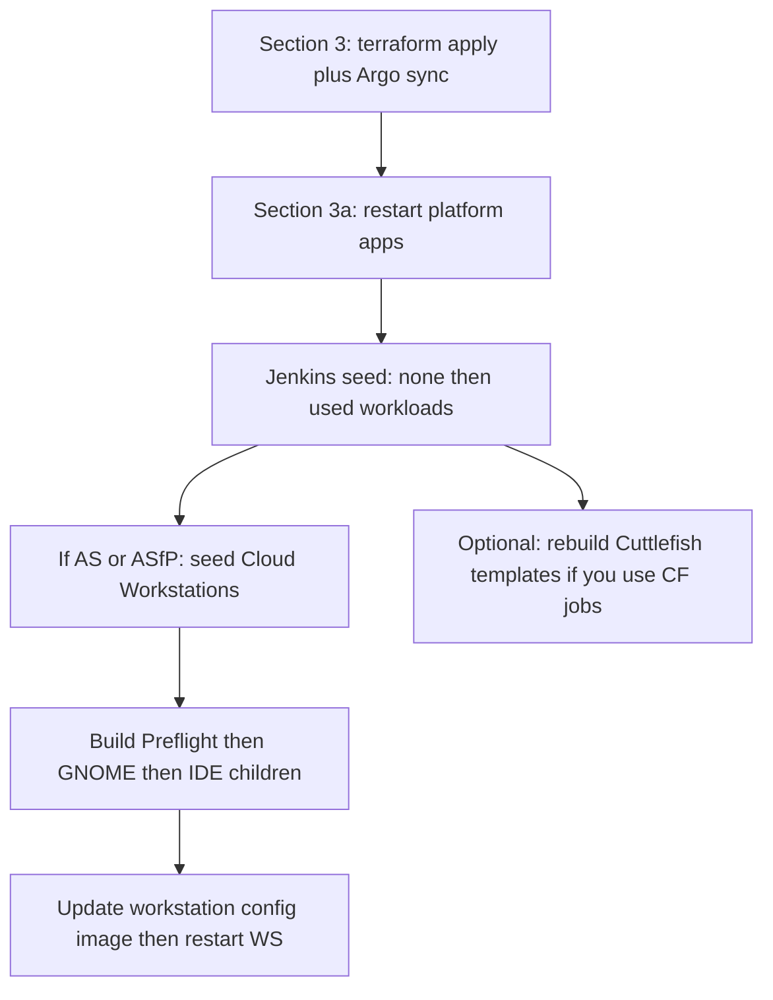

<!-- Copyright (c) 2026 Accenture, All Rights Reserved.

Licensed under the Apache License, Version 2.0 (the "License");
you may not use this file except in compliance with the License.
You may obtain a copy of the License at

        http://www.apache.org/licenses/LICENSE-2.0

Unless required by applicable law or agreed to in writing, software
distributed under the License is distributed on an "AS IS" BASIS,
WITHOUT WARRANTIES OR CONDITIONS OF ANY KIND, either express or implied.
See the License for the specific language governing permissions and
limitations under the License. -->

# Upgrade Guide: 4.1.0 to 4.2.0

This guide explains how to upgrade an existing Horizon SDV 4.1.0 environment to 4.2.0.

This is a brownfield cutover. It is not a greenfield install ([deployment_guide.md](../deployment_guide.md)). The steps below come from comparing Horizon SDV 4.1.0 to 4.2.0. They were cross-checked against a cluster that already runs 4.2.0. That cluster is not a recorded 4.1.0-to-4.2.0 rehearsal, so review the Terraform plan for **your** state before you apply.

## Table of Contents

- [Overview](#overview)
- [Prerequisites](#prerequisites)
- [Configuration Placeholders](#configuration-placeholders)
- [Section #1 - Update the Repository](#section-1---update-the-repository)
- [Section #2 - Align terraform.tfvars](#section-2---align-terraformtfvars)
  - [Section #2a - GKE version if apply fails](#section-2a---gke-version-if-apply-fails)
- [Section #3 - Run the Deployment Script](#section-3---run-the-deployment-script)
  - [Section #3a - Redeploy platform applications](#section-3a---redeploy-platform-applications)
  - [Section #3b - Stuck modules in Developer Portal](#section-3b---stuck-modules-in-developer-portal)
  - [Section #3c - Optional storage modules](#section-3c---optional-storage-modules)
  - [Section #3d - Workload upgrades (release checklist) - CI/CD](#section-3d---workload-upgrades-release-checklist---cicd)
- [Section #4 - Verification](#section-4---verification)
- [Related documentation](#related-documentation)

---


## Overview

Release 4.2.0 changes GitOps ownership, Config Connector mode, platform entry URLs, and Cloud Workstation images. There are **no new `terraform.tfvars` keys** between 4.1.0 and 4.2.0. You still must review `terraform plan` because apply updates GKE add-ons, IAM, firewalls, and image builds.

**Keep enabled modules as-is.** Do not disable all modules before the upgrade. Re-enable is not a no-op. Disabling `**workloads-android`** deletes Cuttlefish `ComputeInstanceTemplate` custom resources and the matching GCE instance templates. Disabling `**sample-data**` empties and deletes `{project_id}-sample-workloads-data`.


| Change                                                                                                         | Action required                                                                                                                                                                                   |
| -------------------------------------------------------------------------------------------------------------- | ------------------------------------------------------------------------------------------------------------------------------------------------------------------------------------------------- |
| `{project_id}-argo-workflows` leaves Terraform; KCC `StorageBucket` with `deletion-policy: abandon`            | [Section #3](#section-3---run-the-deployment-script): confirm the `removed` block is **state-only**. Never approve a destroy of that GCS bucket.                                                  |
| Config Connector cluster mode; per-namespace `ConfigConnectorContext` (CCC) is not in desired state            | Keep modules enabled. After sync, prune leftover CCC from the **owning** Argo Application ([Section #3b](#section-3b---stuck-modules-in-developer-portal)).                                       |
| Standalone landing page removed; `/` redirects to Developer Portal                                             | [Section #3a](#section-3a---redeploy-platform-applications); verify Landing tab.                                                                                                                  |
| Platform images: `module-manager` tag stays `0.3.2`, portal tag stays `1.1.0`, `horizon-api` `1.0.0` → `1.0.1` | [Section #3a](#section-3a---redeploy-platform-applications): restart portal and module-manager; sync API.                                                                                         |
| MTK Connect chart `v1.12.1`                                                                                    | Applied with GitOps in [Section #3](#section-3---run-the-deployment-script). Spot-check MTK after sync.                                                                                           |
| Optional catalog modules `storage-gcs` and `sample-data`                                                       | [Section #3c](#section-3c---optional-storage-modules) only if you need them.                                                                                                                      |
| Cloud Workstations: Preflight → GNOME → Android Studio / ASfP; Guacamole/RDP                                   | [Section #3d](#section-3d---workload-upgrades-release-checklist---cicd) if you use AS/ASfP. Code OSS stays on the legacy stack.                                                                   |
| GKE NodeLocal DNSCache forced off; VPC deny-all ingress; storage-gcs IAM                                       | Review in `terraform plan` during [Section #3](#section-3---run-the-deployment-script).                                                                                                           |
| GKE `sdv_cluster_version` vs release channel                                                                   | Keep the version this environment already runs. Change it only if apply fails because GKE no longer serves that version on the channel ([Section #2a](#section-2a---gke-version-if-apply-fails)). |


---


## Prerequisites

Before starting the upgrade:

- The **4.1.0 environment is fully deployed and healthy**. Argo CD applications should be `Synced` and `Healthy`.
- Terraform CLI `**>= 1.14.2**` (required by `terraform/modules/base/version.tf`) so the `removed` block is valid.
- You can run the deployment workflow (`container-deploy.sh` or `deploy.sh`).
- You have Argo CD admin access ([Deployment Guide - Homepage not reachable](../deployment_guide.md#section-6f---homepage-not-reachable-after-deployment)). Use Argo CD at `https://<SUB_DOMAIN>.<HORIZON_DOMAIN>/argocd` for sync, prune, and recovery. Do not use the removed standalone landing page.
- **Keep enabled modules as-is during upgrade.** After `module-manager` restarts, reset modules that should follow the platform branch if they show **Pinned** on an old ref ([Section #3a](#section-3a---redeploy-platform-applications)).
- Inventory before apply (names only; do not change them yet):
  - `terraform state list | grep argo` (expect `module.sdv_gcs_argo_workflows` or similar under `module.base`)
  - GCS bucket `{project_id}-argo-workflows`
  - `kubectl get configconnectorcontext.core.cnrm.cloud.google.com -A`
  - Enabled Developer Portal modules
  - Cloud Workstation configs and image names, if used
  - MTK Connect version currently running
- If you use Android Studio or ASfP workstations: plan image rebuild time and workstation restart. GNOME/IDE builds that run in-image Docker (Guacamole) and nested virtualization need a machine type that supports both ([workstation_images.md](../workloads/cloud-workstations/workstation_images.md)).

---


## Configuration Placeholders


| Placeholder      | Description                                      | Example                    |
| ---------------- | ------------------------------------------------ | -------------------------- |
| `SUB_DOMAIN`     | Environment subdomain (`sdv_env_name` in tfvars) | `sbx`                      |
| `HORIZON_DOMAIN` | Root domain (`sdv_root_domain` in tfvars)        | `example.com`              |
| `GCP_PROJECT_ID` | GCP project ID                                   | `my-cloud-project-abc-123` |


---

## Section #1 - Update the Repository

Check out the 4.2.0 published content and pull the latest changes. Use the branch this environment already deploys (`BRANCH_NAME` in tfvars). On the public [horizon-sdv](https://github.com/GoogleCloudPlatform/horizon-sdv) repository that is typically `main`.

```bash
git fetch origin
git checkout <BRANCH_NAME>
git pull
```

---

## Section #2 - Align terraform.tfvars

4.1.0 and 4.2.0 do **not** add or rename operator keys in `terraform/env/terraform.tfvars` / `terraform.tfvars.sample`. You do not need a 4.1-style tfvars rewrite.

Still open `**terraform/env/terraform.tfvars**` and confirm it matches how this environment was deployed (project, domain, SCM branch, GKE, ARM64). Then rely on **plan review** in [Section #3](#section-3---run-the-deployment-script). IAM for `gke-storage-gcs-module-sa` and the extra Config Connector Workload Identity binding live in Terraform modules, not in new tfvars.

### Section #2a - GKE version if apply fails

4.2.0 does **not** require a GKE upgrade for the platform cutover. Keep `**sdv_cluster_version`** and `**sdv_cluster_release_channel**` as this environment already uses. 4.2.0 testing used the control plane version documented in `**terraform/env/terraform.tfvars.sample**`. That string is a floor (`min_master_version`), not a pin. Do not copy a newer sample value just because the sample changed.

If [Section #3](#section-3---run-the-deployment-script) fails because the requested version is not available on the release channel (GKE may suggest `**EXTENDED**`), pick a version that is valid **for your channel and region**. Do **not** switch to `**EXTENDED`**. This repo enables the Config Connector GKE add-on by default, and that add-on is not allowed on `EXTENDED` clusters. Details are in the `**# GKE cluster**` comments in `**terraform/env/terraform.tfvars.sample**`.

List versions GKE will accept:

```bash
gcloud container get-server-config --location=<REGION> \
  --flatten='channels' --filter='channels.channel=<CHANNEL>' \
  --format='yaml(channels.defaultVersion,channels.validVersions)'
```

Use your cluster region and the channel already in tfvars (`STABLE`, `REGULAR`, `RAPID`, or `UNSPECIFIED`). Set `**sdv_cluster_version**` to a `**validVersions**` entry on that channel (same minor line if you can, for example stay on 1.34.x if that is what you run). Raising the floor can upgrade the control plane. That is expected. Then re-run [Section #3](#section-3---run-the-deployment-script).

---

## Section #3 - Run the Deployment Script

From `tools/scripts/deployment`:

**Containerized:**

```bash
docker rmi horizon-sdv-deployer:latest   # optional: refresh deployer image
./container-deploy.sh --apply
```

**Linux native:**

```bash
./deploy.sh --apply
```

Review the plan before you confirm apply. Expected themes (exact resource addresses depend on **your** state):


| Theme                 | What to look for                                                                                                                                                                                                                                                                                       | Stop if                                                                                                                                                                                                                                                                   |
| --------------------- | ------------------------------------------------------------------------------------------------------------------------------------------------------------------------------------------------------------------------------------------------------------------------------------------------------ | ------------------------------------------------------------------------------------------------------------------------------------------------------------------------------------------------------------------------------------------------------------------------- |
| Argo Workflows bucket | `removed` from `module.sdv_gcs_argo_workflows` with `**destroy = false**` (`terraform/modules/base/main.tf`). GitOps later adopts `{project_id}-argo-workflows` as KCC `StorageBucket` (`gitops/templates/argo-workflows-bucket.yaml`, annotation `cnrm.cloud.google.com/deletion-policy: "abandon"`). | Plan **destroys** the GCS bucket or objects. If the `removed` address does not match state, confirm with `terraform state list | grep argo` and use the commented `terraform state rm` equivalent in `terraform/modules/base/main.tf` **only** after the address matches. |
| GKE                   | `dns_cache_config { enabled = false }` (NodeLocal DNSCache off). Required so existing NetworkPolicies that match kube-dns pods still allow DNS on GKE 1.34.1-gke.3720000+.                                                                                                                             | Unexpected cluster recreate. Version not available on the release channel: keep the channel, pick a valid `sdv_cluster_version` ([Section #2a](#section-2a---gke-version-if-apply-fails)). Do not set `EXTENDED`.                                                         |
| IAM                   | New `gke-storage-gcs-module-sa`, custom role `horizonStorageGcsBucketCreator`, conditional `roles/storage.admin` on `{project_id}-*` buckets, Workload Identity for `horizon/storage-gcs-module` and `cnrm-system/cnrm-controller-manager`                                                             | Project-wide TokenCreator you did not expect (storage-gcs TokenCreator is on that SA only)                                                                                                                                                                                |
| Network               | New `deny-all-ingress` firewall (priority 65000); Private Google Access / flow-log updates on subnets including the GKE master pe-subnet                                                                                                                                                               | Allow rules for IAP, health checks, and internal traffic missing relative to the new deny                                                                                                                                                                                 |
| Images                | New `storage-gcs-module-app:1.0.0`; `horizon-api-app` `1.0.1`; content-hash rebuilds of `module-manager-app:0.3.2` and `horizon-dev-portal:1.1.0`; `landingpage-app` no longer built                                                                                                                   |                                                                                                                                                                                                                                                                           |


Wait until Argo CD syncs `**horizon-sdv**` and child applications (`**Synced**` / `**Healthy**`) before [Section #3a](#section-3a---redeploy-platform-applications). Expect the standalone **landingpage** Application and related HTTPRoute to be pruned. Site root becomes a **301** to `/developer-portal/` (`gitops/templates/gateway-horizon-dev-portal.yaml`).

Confirm KCC:

```bash
kubectl get configconnector.core.cnrm.cloud.google.com configconnector.core.cnrm.cloud.google.com -o yaml
```

`spec.mode` should be `cluster` on the main environment (`gitops/templates/config-connector.yaml`). Confirm the Argo Workflows bucket still exists in GCS and that the KCC `StorageBucket` `argo-workflows` in the `{prefix}horizon` namespace is Healthy (or Progressing toward Ready) with abandon deletion policy.

### Section #3a - Redeploy platform applications

> [!IMPORTANT]
> Run this **after** [Section #3](#section-3---run-the-deployment-script) completes and `**horizon-sdv`** is `**Synced**` / `**Healthy**`. Brief downtime for these apps is expected.

4.2.0 rebuilds platform images even when some **tags** do not change. `**module-manager`** must roll so startup sync and catalog (including `storage-gcs` / `sample-data`) apply. `**horizon-dev-portal**` must roll for Landing-page consolidation and module status UI. `**horizon-api**` moves to tag `**1.0.1**`. `**workflow-namespace-drain**` is updated by Terraform during [Section #3](#section-3---run-the-deployment-script) (not managed in Argo CD).

#### Argo CD - sync platform applications

Open Argo CD: `https://<SUB_DOMAIN>.<HORIZON_DOMAIN>/argocd` (admin credentials: [Deployment Guide - Homepage not reachable](../deployment_guide.md#section-6f---homepage-not-reachable-after-deployment)).

1. Confirm the root app `**horizon-sdv**` is `**Synced**` / `**Healthy**`. If not: **Refresh** → **Sync**.
2. Open each child Application (add your `<namespacePrefix>` if your environment uses one, for example `sbx-module-manager`):
  - `**module-manager**`
  - `**horizon-dev-portal**`
  - `**horizon-api**`
  - `**mtk-connect**` (chart version `**v1.12.1**`)
3. For each app: **Refresh** → **Sync** (use **Hard refresh** if **OutOfSync**).

This step only applies Git. It does **not** recreate pods when the image **tag** is unchanged (`module-manager` `0.3.2`, `horizon-dev-portal` `1.1.0`). After Sync, continue to **Restart Deployments** below.

There is no **landingpage** Application to sync.

#### Restart Deployments - required behavior differs by app

[Section #3](#section-3---run-the-deployment-script) rebuilds images in Artifact Registry. Kubernetes only starts a new pod when the Deployment spec changes or you recreate the pod. `**imagePullPolicy: Always**` does not refresh a running pod that still matches the same tag.


| App                      | Tag 4.1.0 → 4.2.0 | Auto-roll on sync? | Action                                                                                                                    |
| ------------------------ | ----------------- | ------------------ | ------------------------------------------------------------------------------------------------------------------------- |
| `**module-manager**`     | `0.3.2` → `0.3.2` | Often **no**       | Sync, then **restart** the Deployment so startup sync runs on the new binary                                              |
| `**horizon-dev-portal**` | `1.1.0` → `1.1.0` | Often **no**       | Sync, then **restart**. Recreating this Deployment refreshes UI polling. It does **not** delete Config Connector objects. |
| `**horizon-api**`        | `1.0.0` → `1.0.1` | Usually **yes**    | Sync; restart if the pod still shows `1.0.0`                                                                              |


Restart from the Argo resource tree (Deployment → ⋮ → Restart) or delete the **pod** (the Deployment recreates it). Prefer **Restart** on the Deployment. Deleting the Argo Application is not a retry; it can prune live resources.

If the new pod still runs the old **tag** or the same image **digest** as before apply, GitOps is not missing a second Sync. Confirm [Section #3](#section-3---run-the-deployment-script) actually pushed a new image to Artifact Registry, then Sync again if the Application is **OutOfSync**, then restart the Deployment once more.

#### Developer Portal - verify enabled modules

Modules enabled under 4.1.0 are not orphaned. State stays in `**ModuleManagerState**`. After `module-manager` restarts:

1. Open **Administration → Modules**: `https://<SUB_DOMAIN>.<HORIZON_DOMAIN>/developer-portal/admin/modules`
2. Open **Landing**: `https://<SUB_DOMAIN>.<HORIZON_DOMAIN>/developer-portal/` (site root should redirect here). Confirm developer and admin app cards.
3. For each enabled module:
  - **Following platform**: aligned to the platform Git ref. No action.
  - **Pinned**: reset with **Reset to platform branch** if it should track 4.2.0 ([Developer Portal user guide](../developer_portal_user_guide.md#change-git-ref-in-developer-portal)). Leave intentional pins as-is.
4. In Argo CD, confirm `mod-*` Applications (for example `mod-workloads-common`, `mod-workloads-android`) target the 4.2.0 Git ref.

If a module stays in **INSTALLATION IN PROGRESS**, **UNINSTALL IN PROGRESS**, or **DEPLOYMENT PENDING**, go to [Section #3b](#section-3b---stuck-modules-in-developer-portal). Do **not** disable the module to “clear KCC.”

#### workflow-namespace-drain (Terraform-managed)

No Argo CD or Developer Portal action. [Section #3](#section-3---run-the-deployment-script) upgrades the Helm release in namespace `{prefix}workflow-namespace-drain`.

#### When to skip

- **Greenfield 4.2.0 install:** [Section #3](#section-3---run-the-deployment-script) already deploys current images; restart only if pods are stale after sync.
- **Pinned modules:** do not use **Reset to platform branch** unless you want them on the platform branch.

### Section #3b - Stuck modules in Developer Portal

Use this only if **Administration → Modules** stays in a transition label after [Section #3a](#section-3a---redeploy-platform-applications), or if a module Argo Application is `**OutOfSync`** / `**Degraded**`.

4.2.0 cluster-mode Config Connector does **not** use per-namespace `**ConfigConnectorContext`**. Sample module charts no longer render CCC. `**workloads-android**` sets `createConfigConnectorContext: false`. Leftover CCC from 4.1.0 namespaced mode can keep an Application degraded. Removal is **Argo prune of the owning Application**, not a portal disable.

1. Open **Argo CD directly**: `https://<SUB_DOMAIN>.<HORIZON_DOMAIN>/argocd`. Do not wait for the portal to recover itself.
2. Confirm `**horizon-dev-portal**` is `**Synced**` and the pod was restarted ([Section #3a](#section-3a---redeploy-platform-applications)). That only refreshes status polling.
3. For each **enabled** stuck module, open `**mod-<module>`** and its child Application (for example `**workloads-android**`). **Refresh**, then **Sync** with **Prune** enabled. Do not prune the entire platform as a shortcut. Prune deletes objects 4.2.0 no longer renders, including per-namespace CCC.
4. If `**workloads-android**` prune hangs on CCC, that is the documented `ComputeInstanceTemplate` / CCC finalizer case. Follow [Cuttlefish instance template - Config Connector and disable notes](../workloads/android/environment/cf_instance_template.md#config-connector-mode-configconnectorcontext). Do not disable `**workloads-android**` to clear CCC (that deletes GCE instance templates).
5. When Argo shows `**Synced**` / `**Healthy**`, reload the Developer Portal. Restart the portal pod again only if the UI is still stale.

### Section #3c - Optional storage modules

Skip this subsection if you do not need GCS operator workflows or sample data.

Enable from **Administration → Modules**, **main environment only** (`storage-gcs` chart templates are skipped for sub-environments):

1. Enable `**storage-gcs**` first (operator + REST API image `storage-gcs-module-app:1.0.0`). Wait until `mod-storage-gcs` is `**Synced**` / `**Healthy**`.
2. Enable `**sample-data**` if you need `{project_id}-sample-workloads-data`. It has a **hard** dependency on `**storage-gcs`**.
3. Optionally keep `**sample**` enabled. It lists `**sample-data**` and `**storage-gcs**` as **soft** dependencies (GCS smoke only when both are on).

> [!IMPORTANT]
> Disabling `**sample-data**` empties and **deletes** `{project_id}-sample-workloads-data` (`deletionPolicy: Delete`). Disabling `**storage-gcs`** is blocked while `**sample-data**` is enabled.

If the cluster still has GCSBucket CR `**workloads-android-data**`, follow [sample-data module - Migrating from workloads-android-data](../../gitops/modules/sample-data-module/README.md#migrating-from-workloads-android-data). Do not delete that CR with `deletionPolicy: Delete` unless you intend to empty the old bucket.

Details: [storage-gcs-module README](../../gitops/modules/storage-gcs-module/README.md).

### Section #3d - Workload upgrades (release checklist) - CI/CD

Run this checklist **after** [Section #3a](#section-3a---redeploy-platform-applications). Skip steps your environment does not use.

> [!IMPORTANT]
> This subsection is a **summary**. For exact parameters, job names, and sequencing, follow [Related documentation](#related-documentation).

This release does **not** require regenerating Android, OpenBSW, utilities, or ABFS **Docker image templates** for the upgrade itself.




#### Developer Portal - Workloads modules

Leave `**workloads-common**` and `**workloads-android**` enabled if they were already on. Enable them only if this environment needs Android workloads and they were off:

1. Open **Administration → Modules** at `https://<SUB_DOMAIN>.<HORIZON_DOMAIN>/developer-portal/admin/modules`
2. Enable `**workloads-common**`, then `**workloads-android**`, in that order.

#### Jenkins - RBAC before seed

Before **Seed Workloads**, ensure operators who will seed or run jobs have Role-based Authorization assignments (**Manage Jenkins** → **Manage and Assign Roles** → **Assign Roles**). See **Jenkins RBAC** in [Related documentation](#related-documentation).

#### Jenkins seed job

1. Run **Seed Workloads** once with `**none`** so Jenkins job parameters refresh.
2. Seed each workload this environment uses:
  - `**cloud-workstations**` if you use Cloud Workstations (required for Preflight, GNOME, Image Chain jobs and `CONTAINER_IMAGE` parameters).
  - `**android**`, `**openbsw**`, `**utilities**`, or `**all**` only if those Jenkins folders are in use so Job DSL updates land.

See [workloads/seed.md](../workloads/seed.md).

Do **not** delete the Jenkins **Workstation Images** folder. Job DSL updates the existing **Horizon Android Studio** and **Horizon Android Studio for Platform (ASfP)** job names in place and adds **Horizon Preflight**, **Horizon GNOME**, and folder **Workstation Image Chain**.

#### Cloud Workstations (required if you use Android Studio or ASfP)

4.1.0 AS/ASfP images used a self-contained noVNC / TigerVNC stack. 4.2.0 uses:

```text
horizon-preflight  →  horizon-gnome  →  horizon-asfp
                                   └→  horizon-android-studio
```

Browser access for GNOME children is Guacamole over RDP (`gnome-remote-desktop`). `**horizon-code-oss**` stays on the legacy Code OSS stack and is not layered on Preflight or GNOME.

1. After seeding Cloud Workstations, build and **push** layers in order (or run **Cloud Workstations → Workstation Image Chain → Horizon AOSP Build Image Chain** with Preflight and GNOME enabled and `NO_PUSH=false` on children you publish). See [workstation_images.md](../workloads/cloud-workstations/workstation_images.md).
2. Point each AS/ASfP **configuration** at the new image using **Update Existing Configuration**: `CONTAINER_IMAGE` = `AS` or `ASfP`, `CONTAINER_IMAGE_TAG` as published (often `latest`). Do not paste a full registry URL. `HOST_BOOT_DISK_SIZE` minimum is **31 GB**; default is **40 GB**. Start Workstation fails below 31 GB. See [config_admin_operations.md](../workloads/cloud-workstations/config_admin_operations.md).
3. **Stop and start** (or otherwise restart) existing workstations so they boot the new image. Updating the config does not rebuild the image and does not replace a running workstation by itself.
4. Validate Guacamole/RDP in the browser. Leave Code OSS configs on `C-OSS (VCS)` unless you intend to change them.

Antigravity Agent/CLI and MCP client mapping on the GNOME-based images: [antigravity.md](../workloads/common/agentic-ai/antigravity.md) and [mcp_setup.md](mcp_setup.md#mcp-client--tool-mapping). Optional after the new images are in use.

#### Cuttlefish GCE instance templates (optional)

Existing published GCE templates can keep running. Rebuild after cutover only if you use the CF Jenkins/Argo jobs and need the 4.2 Packer `googlecompute` plugin bounds and cluster-mode KCC publish path (`createConfigConnectorContext: false`). See [cf_instance_template.md](../workloads/android/environment/cf_instance_template.md).

---

## Section #4 - Verification

After [Section #3](#section-3---run-the-deployment-script), [Section #3a](#section-3a---redeploy-platform-applications), and any applicable [Section #3b](#section-3b---stuck-modules-in-developer-portal) / [Section #3c](#section-3c---optional-storage-modules) / [Section #3d](#section-3d---workload-upgrades-release-checklist---cicd) steps:

1. Terraform state no longer manages `{project_id}-argo-workflows` as `module.sdv_gcs_argo_workflows`. The GCS bucket still exists. KCC `StorageBucket` `argo-workflows` uses abandon deletion policy.
2. `ConfigConnector` `spec.mode` is `cluster` (main env). Leftover per-namespace CCC is gone or only present if you intentionally run namespaced-mode KCC.
3. Cluster DNS still works with NetworkPolicies (NodeLocal DNSCache off). IAP/SSH and load-balancer health checks still work with the new deny-all ingress rule.
4. Argo CD: `**horizon-sdv**` and children `**Synced**` / `**Healthy**`. No **landingpage** app.
5. `https://<SUB_DOMAIN>.<HORIZON_DOMAIN>/` redirects to `**/developer-portal/**`. Landing cards open cluster apps. Direct paths such as `/argocd` and `/jenkins` still work.
6. `**module-manager**` and `**horizon-dev-portal**` pods were recreated after apply. `**horizon-api**` image is `**horizon-api-app:1.0.1**`.
7. Enabled modules are **Following platform** or **Pinned** only where intended. Transition labels are cleared ([Section #3b](#section-3b---stuck-modules-in-developer-portal) if not).
8. Optional: `**storage-gcs**` then `**sample-data**` Healthy if you enabled them.
9. MTK Connect is on chart `**v1.12.1**`. Spot-check UI / testbench creation if you use MTK.
10. If you use Cloud Workstations AS/ASfP: new images published; configs use `AS` / `ASfP`; workstations restarted; Guacamole session works. Code OSS still on the legacy image if you left it there.
11. Jenkins: Seed completed for used workloads; Cloud Workstations folders include Preflight, GNOME, and Workstation Image Chain when CW was seeded.

If apply or sync fails mid-way: re-run the deploy script, Refresh → Sync `**horizon-sdv**`, then [Section #3a](#section-3a---redeploy-platform-applications) / [Section #3b](#section-3b---stuck-modules-in-developer-portal). This guide does not define a full platform rollback to 4.1.0.

---


## Related documentation

Authoritative guides referenced by this upgrade. Use these for exact parameters, job names, and operational detail.


| Area                                          | Documentation                                                                                                                                                                                                                   |
| --------------------------------------------- | ------------------------------------------------------------------------------------------------------------------------------------------------------------------------------------------------------------------------------- |
| Terraform variables                           | [terraform.md](../terraform.md)                                                                                                                                                                                                 |
| Deployment workflow (greenfield)              | [deployment_guide.md](../deployment_guide.md)                                                                                                                                                                                   |
| Other upgrade paths                           | [guides/README.md](README.md#upgrade-guides)                                                                                                                                                                                    |
| Developer Portal (Landing, modules, git ref)  | [developer_portal_user_guide.md](../developer_portal_user_guide.md)                                                                                                                                                             |
| Storage GCS module                            | [gitops/modules/storage-gcs-module/README.md](../../gitops/modules/storage-gcs-module/README.md)                                                                                                                                |
| sample-data module                            | [gitops/modules/sample-data-module/README.md](../../gitops/modules/sample-data-module/README.md)                                                                                                                                |
| Jenkins RBAC (**Manage and Assign Roles**)    | [Pipeline Guide - Role Based Strategy](../workloads/guides/pipeline_guide.md#rolebasedstrategy) [Deployment Guide - Jenkins access via Keycloak groups](../deployment_guide.md#section-3e---jenkins-access-via-keycloak-groups) |
| Seed jobs and Jenkins parameters              | [workloads/seed.md](../workloads/seed.md)                                                                                                                                                                                       |
| Cloud Workstation images                      | [workstation_images.md](../workloads/cloud-workstations/workstation_images.md)                                                                                                                                                  |
| Cloud Workstation configs (`CONTAINER_IMAGE`) | [config_admin_operations.md](../workloads/cloud-workstations/config_admin_operations.md)                                                                                                                                        |
| Antigravity on workstation images             | [antigravity.md](../workloads/common/agentic-ai/antigravity.md)                                                                                                                                                                 |
| MCP client mapping                            | [mcp_setup.md](mcp_setup.md#mcp-client--tool-mapping)                                                                                                                                                                           |
| Cuttlefish GCE instance templates             | [cf_instance_template.md](../workloads/android/environment/cf_instance_template.md)                                                                                                                                             |
| Container image CVE maintenance               | [container_image_security_upgrade_guide.md](container_image_security_upgrade_guide.md)                                                                                                                                          |


