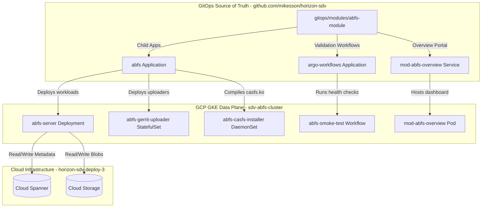

# Horizon-SDV: Android Build File System (ABFS) Module Integration Guide

This guide documents in full technical detail how the Android Build File System (ABFS) data-plane module is integrated into the Horizon-SDV platform repository (`https://github.com/mikesson/horizon-sdv`) and deployed via GitOps.

---

## 1. Executive Summary & Architecture Overview

The **Android Build File System (ABFS)** is integrated directly as a native platform application module inside the central GitOps framework of **Horizon-SDV**. It is managed, scaled, and synced declaratively under the core GitOps structures.



---

## 2. GitOps Integration Strategy: The Dedicated Module (`/gitops/modules/abfs-module`)

The ABFS module is structured as a native, self-contained **Argo CD App-of-Apps parent chart** located at:
`gitops/modules/abfs-module/`

This parent module orchestrates the delivery of three major sub-components across your dedicated GKE cluster:
1. **The Core Data Plane (`abfs/` sub-chart)**: Deploys the main `abfs-server`, Gerrit uploaders, and kernel installers.
2. **The Validation Engine (`argo-workflows/` sub-chart)**: Deploys automated test suites and smoke-test templates (`abfs-smoke-test`) to run health assertions after deployment.
3. **The Interactive UI Portal (`portal/` + `templates/module-overview-http.yaml`)**: Spins up a static dashboard (`overview.html`) exposed via a GKE gateway HTTPRoute, providing real-time operational state metrics and link portals for developers.

---

## 3. Module File Layout & Structural Breakdown

The integrated module within your repository is structured as follows:

```
gitops/modules/abfs-module/
├── Chart.yaml              # App-of-Apps helm module chart definition (v0.2.0)
├── values.yaml             # Module-manager context parameters and namespacing config
├── abfs/                   # Core Data Plane sub-chart
│   ├── Chart.yaml          # Pinned dependency definitions
│   ├── values.yaml         # Resource caps, replication overrides, and sharding limits
│   └── templates/          # Kubernetes manifests (deployments, statefulsets, daemonsets, secrets)
├── argo-workflows/         # Smoke-test validation sub-chart
│   ├── Chart.yaml          # Argo-workflows helper definition
│   ├── values.yaml         # Test execution intervals and parameter overrides
│   └── templates/          # Declarative Argo WorkflowTemplates for automated testing
├── templates/              # Parent app-of-apps template rendering manifests
│   ├── application-abfs.yaml             # Declares the ArgoCD Child App for the abfs workloads
│   ├── application-argo-workflows.yaml    # Declares the ArgoCD Child App for automated validations
│   └── module-overview-http.yaml         # Declares HTTPRoutes and Services for the UI Portal
└── portal/
    └── overview.html       # HTML5 code for the static status and operational overview page
```

---

## 4. Key Workload Definitions & Helm Orchestration

### A. Child Applications (`templates/application-*.yaml`)
The parent chart leverages Argo CD's App-of-Apps pattern to declare child applications:
- **`application-abfs.yaml`**: Mounts the core ABFS workloads, pinning the source repository URL and targeting the dedicated `sdv-abfs-cluster`.
- **`application-argo-workflows.yaml`**: Schedules automated `Workflow` resources that execute validation tests against GKE.

### B. The Interactive Dashboard (`portal/overview.html`)
Spins up a lightweight static Nginx web service (`mod-abfs-overview`) which renders a beautiful, modern CSS status board. It displays connection strings, repository sync statuses, active Gerrit sharding configurations, and diagnostics URLs for developers.

### C. GKE HTTPRoute Gateway Routing (`templates/module-overview-http.yaml`)
Ensures that the dashboard is automatically exposed under the platform domain namespace via an Envoy-backed GKE Gateway.

---

## 5. Architectural Rationale: HOW and WHY

### A. Why an App-of-Apps Module inside `/gitops/modules/`?
* **HOW**: Integrated the ABFS templates as a sub-chart under `gitops/modules/abfs-module/`.
* **WHY**:
  1. **Platform Unified Lifecycle**: It allows the Horizon DevOps Module Manager to dynamically toggle, upgrade, and configure ABFS alongside other modules (like `gerrit` or `mtk-connect`).
  2. **Argo CD Synchronization**: By packing workloads into an App-of-Apps pattern, Argo CD automatically tracks and reconciles application state drift on the dedicated GKE cluster while pulling direct updates from `github.com/mikesson/horizon-sdv`.

### B. Why is the GCS/Spanner Config Connector (KCC) Mapped to Helm Values?
* **HOW**: Parameterized all IAM, GCS, and Spanner manifests into clean Go Helm template statements in the sub-charts:
  ```yaml
  projectID: {{ .Values.config.projectID }}
  ```
* **WHY**:
  - **Environment Portability**: Eliminates hardcoded environment values (like project IDs, GCS bucket names, and DNS values). This ensures the identical module can be deployed dynamically across staging, production, and sandbox environments without modifying the base git branch.

### C. Why are CASFS Host-Kernel Settings Isolated?
* **HOW**: Pinned the host-level DaemonSet and privilege contexts (`privileged: true`, `hostPID: true`) within the dedicated `abfs` sub-chart templates.
* **WHY**:
  - **Security Bound Isolation**: Separating the host-privileged `casfs` compilation workloads from standard, non-privileged cluster applications keeps the platform core workspace completely secure and secure.
