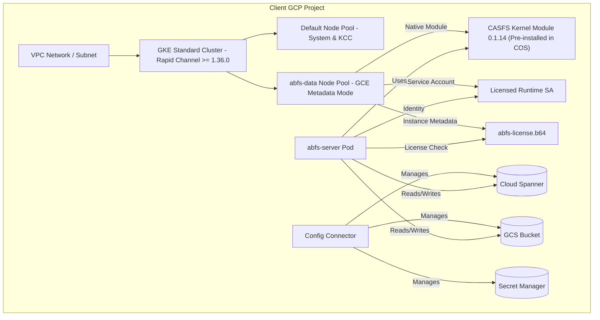

# Standalone ABFS GKE Standard & KCC Deployment Guide
This guide provides a comprehensive, production-grade, step-by-step blueprint to deploy a standalone **Android Build File System (ABFS)** data plane on a clean Google Cloud Platform (GCP) project.

Our architecture leverages **GKE Standard** on the **Rapid Channel** combined with **Config Connector (KCC)** to provision and manage all supporting services (Cloud Spanner, Google Cloud Storage, Secret Manager, Private DNS, and Firewall rules) declaratively. It utilizes the native **COS-integrated CASFS kernel module (0.1.14)** to eliminate manual driver compilations, simplify node pool upgrades, and deliver sandbox-to-production scalability.

---

## 📖 Table of Contents
1. [Architecture Overview](#1-architecture-overview)
2. [Pre-Deployment Checklist & Quotas](#2-pre-deployment-checklist--quotas)
3. [Workspace Navigation](#3-workspace-navigation)
4. [Parameterizing your GCP Project ID](#4-parameterizing-your-gcp-project-id)
5. [VPC Networking & NAT Gateway](#5-vpc-networking--nat-gateway)
6. [GKE Cluster Provisioning](#6-gke-cluster-provisioning)
7. [Config Connector (KCC) Operator Setup](#7-config-connector-kcc-operator-setup)
8. [Core Infrastructure Declarative Deployment](#8-core-infrastructure-declarative-deployment)
9. [Two-Phase SA and License Provisioning](#9-two-phase-sa-and-license-provisioning)
10. [Dedicated Node Pool Creation](#10-dedicated-node-pool-creation)
11. [Deploying ABFS Workloads (Helm)](#11-deploying-abfs-workloads-helm)
12. [Live Validation & Verification](#12-live-validation--verification)

---

## 1. Architecture Overview

To provide sandbox isolation and maximum security, the standalone ABFS deployment segregates administrative control planes from data workloads. 



### Key Pillars
*   **Zero-Compile Node Management (`casfs.provider=image`)**: Bypasses the legacy ubuntu-based out-of-tree (OOT) installer. Nodes boot instantly on standard Container-Optimized OS (COS) images containing pre-signed modules, allowing transparent cluster upgrades.
*   **Metadata-Only Licensed Identity**: Workload Identity is bypassed (`--workload-metadata=GCE_METADATA`) on the `abfs-data` pool. This forces pods to use the node GCE VM identity token directly, ensuring robust, Google-signed VM identity entitlement check.
*   **Completely Declarative Control Plane**: KCC is utilized to spin up and keep GCP infrastructure in sync using native Kubernetes manifests.

---

## 2. Pre-Deployment Checklist & Quotas

Before executing the deployment, ensure your GCP target project is configured with billing and has sufficient regional quotas.

### A. Quota Increase Requests (QIR)
Go to **IAM & Admin > Quotas** in the GCP Console and ensure your target region (e.g., `europe-west3`) has quotas requested and approved:

| Quota Metric / Filter ID | Target Level (Sandbox) | Target Level (Production) | Description |
| :--- | :--- | :--- | :--- |
| `compute.googleapis.com/cpus_all_regions` | **8** | **64** | Global vCPUs across all regions. |
| `HDB-TOTAL-GB-per-project-region` | **500 GB** | **15,000 GB** | Total Hyperdisk Balanced storage capacity in target region. |
| Regional CPU limit (e.g., `N2_CPUS`) | **8** | **64** | Regional vCPUs for chosen machine family. |

---
 
## 3. Workspace Navigation

Before executing any commands, change your working directory to the consolidated module subdirectory. This guarantees that all relative paths for declarative YAML templates and Helm configurations (such as `rendered/` and `chart/`) resolve flawlessly:

```bash
cd incubator/kcc-google-abfs/
```

---

## 4. Parameterizing your GCP Project ID

Before deploying, you must substitute the template placeholder `YOUR_PROJECT_ID` across all manifests and Helm configurations with your actual GCP Project ID.

You can execute this instantly across all files in your workspace with this single command:

```bash
# Replace 'my-gcp-project' with your actual GCP Project ID
export MY_PROJECT_ID="my-gcp-project"
find . -type f -not -path '*/.*' -exec sed -i "s/YOUR_PROJECT_ID/${MY_PROJECT_ID}/g" {} +
```

---

## 5. VPC Networking & NAT Gateway
 
Private nodes are recommended. Create a dedicated private VPC with custom subnets, a Cloud Router, and NAT for outbound internet access (required for image downloads and GKE registration).
 
```bash
# 1. Create a custom-mode VPC
gcloud compute networks create vpc-abfs --subnet-mode=custom
 
# 2. Create a private subnet with Private Google Access enabled (essential for KCC and GKE nodes)
gcloud compute networks subnets create subnet-abfs \
  --network=vpc-abfs \
  --region=europe-west3 \
  --range=10.0.0.0/20 \
  --enable-private-ip-google-access
 
# 3. Provision Cloud Router for egress
gcloud compute routers create router-abfs \
  --network=vpc-abfs \
  --region=europe-west3
 
# 4. Provision Cloud NAT Gateway attached to the router
gcloud compute routers nats create nat-abfs \
  --router=router-abfs \
  --region=europe-west3 \
 --auto-allocate-nat-external-ips \
  --nat-all-subnet-ip-ranges
```
 
---
 
## 6. GKE Cluster Provisioning
 
Deploy a GKE Standard cluster using the **Rapid Channel** to guarantee that the nodes boot into GKE version `1.36.0` or newer, ensuring Native CASFS module compatibility.
 
```bash
# Note: You can omit --cluster-version to automatically select the default Rapid Channel release,
# or list active Rapid channel releases via: gcloud container get-server-config --region=europe-west3
gcloud container clusters create abfs \
  --region=europe-west3 \
  --node-locations=europe-west3-a \
  --release-channel=rapid \
  --cluster-version=1.36.0-gke.4681000 \
  --network=vpc-abfs \
  --subnetwork=subnet-abfs \
  --enable-private-nodes \
  --enable-ip-alias \
  --master-ipv4-cidr=172.16.0.0/28 \
  --machine-type=n4-standard-16 \
  --num-nodes=1 \
  --workload-pool=YOUR_PROJECT_ID.svc.id.goog \
  --enable-shielded-nodes \
  --shielded-secure-boot \
  --shielded-integrity-monitoring
```

---

## 7. Config Connector (KCC) Operator Setup

Enable the Config Connector addon in your cluster and link its controller manager to a privileged GCP Service Account (SA, short for "Service Account") using Workload Identity.

```bash
# 1. Enable KCC addon on the cluster
gcloud container clusters update abfs \
  --region=europe-west3 \
  --update-addons ConfigConnector=ENABLED

# 2. Create the GCP Service Account for KCC administration
gcloud iam service-accounts create cnrm-system --project=YOUR_PROJECT_ID

# 3. Grant the KCC SA Owner permissions on the project
gcloud projects add-iam-policy-binding YOUR_PROJECT_ID \
  --member="serviceAccount:cnrm-system@YOUR_PROJECT_ID.iam.gserviceaccount.com" \
  --role="roles/owner"

# 4. Bind the in-cluster KCC controller KSA to the GCP Service Account
gcloud iam service-accounts add-iam-policy-binding \
  cnrm-system@YOUR_PROJECT_ID.iam.gserviceaccount.com \
  --member="serviceAccount:YOUR_PROJECT_ID.svc.id.goog[cnrm-system/cnrm-controller-manager-abfs]" \
  --role="roles/iam.workloadIdentityUser" \
  --project=YOUR_PROJECT_ID
```

Apply the following core operator ConfigConnector configuration:

```yaml
# configconnector.yaml
apiVersion: core.cnrm.cloud.google.com/v1beta1
kind: ConfigConnector
metadata:
  name: configconnector.core.cnrm.cloud.google.com
spec:
  mode: cluster
  googleServiceAccount: cnrm-system@YOUR_PROJECT_ID.iam.gserviceaccount.com
```
```bash
kubectl apply -f configconnector.yaml
```
### Troubleshooting

#### Configuring Workload Identity for Config Connector (Cluster Mode)

When setting up a new cluster or enabling the GKE Config Connector Add-on, you must link the Kubernetes controller to a Google Cloud Service Account and grant the appropriate IAM permissions so it can provision infrastructure.

Run the following commands to configure the bindings and force the controller to pick up the new credentials:

```bash
# 1. Set environment variables

export PROJECT_ID="your-project-id"
export KCC_SA_NAME="cnrm-system" # The Google Cloud Service Account for Config Connector
export KCC_SA_EMAIL="${KCC_SA_NAME}@${PROJECT_ID}.iam.gserviceaccount.com"

# 2. Annotate the Kubernetes Service Account

kubectl annotate serviceaccount \
  --namespace cnrm-system \
  cnrm-controller-manager \
  iam.gke.io/gcp-service-account=${KCC_SA_EMAIL} \
  --overwrite

# 3. Grant Workload Identity Impersonation

gcloud iam service-accounts add-iam-policy-binding \
  ${KCC_SA_EMAIL} \
  --role="roles/iam.workloadIdentityUser" \
  --member="serviceAccount:${PROJECT_ID}.svc.id.goog[cnrm-system/cnrm-controller-manager]" \
  --project="${PROJECT_ID}"

# 4. Grant project resource management permissions

gcloud projects add-iam-policy-binding ${PROJECT_ID} \
  --member="serviceAccount:${KCC_SA_EMAIL}" \
  --role="roles/owner"

# 5. Force token refresh by restarting the controller pod

kubectl delete pod cnrm-controller-manager-0 -n cnrm-system
Create the dedicated `abfs` workload namespace, annotated with your GCP project ID:

```yaml
# namespace.yaml
apiVersion: v1
kind: Namespace
metadata:
  name: abfs
  annotations:
    cnrm.cloud.google.com/project-id: "YOUR_PROJECT_ID"
```
```bash
kubectl apply -f namespace.yaml
```

---

## 8. Core Infrastructure Declarative Deployment

Under KCC, apply your declarative resource manifest bundle representing Spanner, GCS Storage, Secret Manager, DNS, and Firewall configurations. 

> [!NOTE]
> For sandbox-grade environments, ensure your SpannerInstance manifest specifies `processingUnits: 100` rather than advanced autoscaling configurations to bypass schema restrictions and reduce costs.

Apply the infrastructure layer:
```bash
kubectl apply -k rendered/standalone/infra/
```

Verify KCC reconciliation progress:
```bash
kubectl get gcp -n abfs
```
*Wait until all resources (Spanner Instance, Database, Bucket, SAs) show `READY: True`.*

---

## 9. Two-Phase SA and License Provisioning

ABFS uses a strict Google-signed VM Identity token check. Follow this two-phase flow to generate the Licensed Service Account and retrieve your license.

### Phase A: Retrieve SA Unique ID
1. Apply the Service Account KCC manifest:
   ```bash
   kubectl apply -f rendered/standalone/infra/10-iam-service-accounts.yaml
   ```
2. Retrieve the Unique ID (OAuth2 Client ID) of the newly created `abfs-runtime` service account:
   ```bash
   gcloud iam service-accounts describe abfs-runtime@YOUR_PROJECT_ID.iam.gserviceaccount.com --project=YOUR_PROJECT_ID --format="value(uniqueId)"
   ```
3. Submit this **SA Email** and **Unique ID**  as well as your **Project ID** and **Project Number** to the Google license team to obtain your `abfs-license.json`.

### Phase B: Pre-stage the License
1. Once you receive `abfs-license.json`, Base64-encode it (without line wraps):
   ```bash
   base64 -w0 abfs-license.json > abfs-license.b64
   ```

---

## 10. Dedicated Node Pool Creation

Provision the dedicated `abfs-data` node pool. **This pool bypasses Workload Identity** (`--workload-metadata=GCE_METADATA`) to expose the GCE metadata server directly to the pods, loaded with the base64-encoded license string.

```bash
gcloud container node-pools create abfs-data \
  --cluster=abfs \
  --region=europe-west3 \
  --node-locations=europe-west3-a \
  --project=YOUR_PROJECT_ID \
  --service-account=abfs-runtime@YOUR_PROJECT_ID.iam.gserviceaccount.com \
  --workload-metadata=GCE_METADATA \
  --scopes=cloud-platform \
  --metadata-from-file abfs-license=./abfs-license.b64 \
  --metadata disable-legacy-endpoints=true \
  --machine-type=n4-standard-16 \
  --disk-type=hyperdisk-balanced \
  --disk-size=100 \
  --enable-autoscaling \
  --min-nodes=0 \
  --max-nodes=4 \
  --shielded-secure-boot \
  --shielded-integrity-monitoring \
  --node-taints=abfs.dev/dedicated=true:NoSchedule \
  --image-type=COS_CONTAINERD
```

---

## 11. Deploying ABFS Workloads (Helm)

Deploy the native **COS-integrated CASFS kernel module loader DaemonSet** to automatically load the pre-compiled `casfs` driver into kernel memory as nodes auto-scale:
```yaml
# casfs-image-loader.yaml
apiVersion: apps/v1
kind: DaemonSet
metadata:
  name: casfs-image-loader
  namespace: abfs
  labels:
    app: casfs-image-loader
spec:
  selector:
    matchLabels:
      app: casfs-image-loader
  template:
    metadata:
      labels:
        app: casfs-image-loader
    spec:
      hostPID: true
      tolerations:
      - key: abfs.dev/dedicated
        operator: Equal
        value: "true"
        effect: NoSchedule
      nodeSelector:
        cloud.google.com/gke-nodepool: abfs-data
      initContainers:
      - name: loader
        image: alpine
        securityContext:
          privileged: true
        command: ["sh", "-c", "nsenter -t 1 -m -u -i -n modprobe casfs"]
      containers:
      - name: pause
        image: registry.k8s.io/pause:3.9
```
```bash
kubectl apply -f casfs-image-loader.yaml
```

Create your high-performance `values-sandbox.yaml` file to utilize the full capacity of your dedicated physical nodes:

```yaml
# values-sandbox.yaml
licensed: true

spanner:
  instance: abfs
  database: abfs

bucket: YOUR_PROJECT_ID-abfs-blobs

server:
  resources:
    requests:
      cpu: "8"
      memory: 32Gi
    limits:
      memory: 32Gi

uploader:
  count: 3
  resources:
    requests:
      cpu: "8"
      memory: 32Gi
    limits:
      memory: 64Gi  # Production recommendation of 64Gi limits prevents indexing OOM recycles
  dataDisk:
    size: 270Gi
    storageClass: hyperdisk-balanced
```

Deploy the Helm chart:
```bash
helm upgrade --install abfs ./rendered/standalone/chart/abfs -f values-sandbox.yaml -n abfs
```

---

## 12. Live Validation & Verification

1. Verify that the ABFS Server and Uploader pods schedule on the dedicated node pool and enter `Running` state:
   ```bash
   kubectl get pods -n abfs -o wide
   ```
2. Verify the server logs. You should see successful connection to Cloud Spanner and verification of the GCE VM licensed identity token:
   ```bash
   kubectl logs -l app.kubernetes.io/name=abfs-server -n abfs
   ```
3. Verify that the FUSE mount directory inside the container is successfully mounted and can read/write data:
   ```bash
   # Run a check on the uploader pod to ensure casfs is mounted
   kubectl exec -it abfs-gerrit-uploader-0 -n abfs -- df -h | grep casfs
   ```


