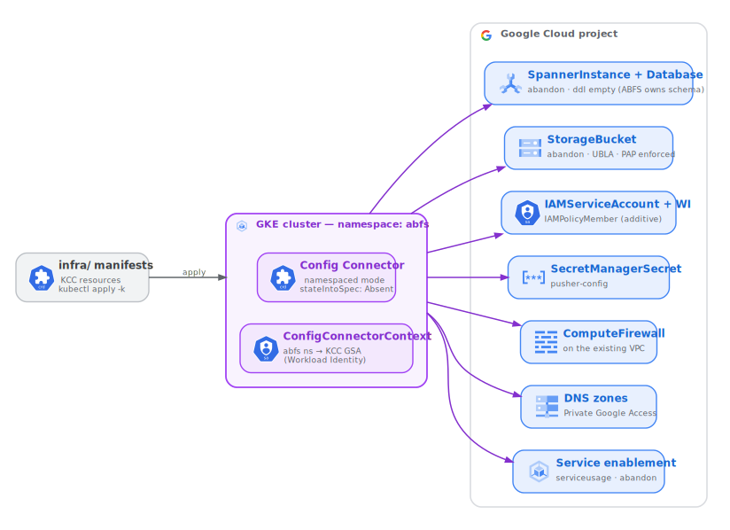

# ABFS on GKE Standard with Config Connector — Overview

This repository deploys the **Android Build File System (ABFS)** as **Kubernetes
workloads on GKE Standard**, with every Google Cloud resource it needs managed
declaratively by **Config Connector (KCC)** and the workloads themselves deployed
by **Helm**.

ABFS is a virtualized, lazy-loading filesystem and content-addressable cache that
accelerates Android source checkouts and builds. Its data plane is an **ABFS
server** (gRPC) backed by **Cloud Spanner** (metadata) and **Cloud Storage**
(blobs), plus **uploaders** that pull content from Gerrit. Clients (Cloud
Workstations, CI) mount and read from it on demand.

This deployment is self-contained: you bring an existing GKE Standard cluster,
KCC reconciles the Google Cloud resources, and Helm installs the ABFS workloads.

## What gets deployed

| Layer | Tooling | Location | What it manages |
|-------|---------|----------|-----------------|
| **Infrastructure** | Config Connector resources | [`infra/`](../infra/) | Cloud Spanner, Cloud Storage, IAM (the licensed runtime service account + project roles), Secret Manager, firewall + DNS (on an existing VPC), API enablement, and an optional Cloud Workstations CI/CD foundation (Secure Source Manager, Cloud Build, Artifact Registry, Cloud Scheduler, Workstations, Private CA). |
| **Application** | Helm chart | [`chart/abfs/`](../chart/abfs/) | The ABFS server, the Gerrit uploaders, the pusher-config bootstrap Job, services (internal gRPC load balancer), the service accounts, ConfigMaps, and NetworkPolicies. |

Config Connector reconciles the Google Cloud resources from `infra/`:

## How it works — key concepts

1. **The cluster pre-exists.** KCC runs *inside* your existing GKE Standard
   cluster and manages only Google Cloud resources — it does not create the
   cluster. The properties your cluster must provide are listed in
   [`02-prerequisites-cluster-and-kcc.md`](./02-prerequisites-cluster-and-kcc.md).
2. **The schema is applied declaratively at deploy.** The ABFS server does **not**
   create or migrate the Spanner schema at runtime; the deploy applies it, exactly
   as the sibling Terraform module does. The bundled schema
   (`infra/schemas/0.0.31-schema.sql`) is mirrored into `SpannerDatabase.spec.ddl`,
   gated by the `CREATE_TABLES` toggle (mirrors Terraform's
   `abfs_spanner_database_create_tables`). Don't edit `spec.ddl` after the first
   apply. See [`03-spanner-schema-ownership.md`](./03-spanner-schema-ownership.md).
3. **You bring the network.** The VPC and subnet are referenced, not created —
   you supply their names. KCC adds only firewall rules and private DNS. Standalone
   and Shared-VPC layouts are both supported.
4. **Privileged pods need the `casfs` kernel module.** ABFS mounts a FUSE/kernel
   filesystem (`casfs`), so its containers run `privileged` + `hostPID`, and the
   `casfs` module must be loaded on each `abfs-data` node. Two modes are supported
   via the chart value `casfs.provider`: **`image`** (default, the forward path) —
   casfs is built into the node image Google ships going forward, so nothing extra
   is deployed; and **`daemonset`** (legacy, interim) — until casfs is in COS, a
   gated `abfs-casfs-installer` DaemonSet loads a Google-signed `casfs.ko` matched
   to each node's COS `BUILD_ID`. On COS the gate on loading out-of-tree modules is
   the **Loadpin** LSM (not Secure Boot), so the legacy mode requires the pool to
   permit Google-signed modules via secure kernel module loading
   (`ENFORCE_SIGNED_MODULES`). See
   [`02-prerequisites-cluster-and-kcc.md` §1b](./02-prerequisites-cluster-and-kcc.md#1b-create-the-dedicated-abfs-node-pool).
5. **GCE-metadata licensing on a dedicated node pool.** ABFS's license enforcement
   is GCE-VM-specific (it reads the license from node instance metadata and needs a
   GCE VM identity token), so the data plane runs on a dedicated `abfs-data` node
   pool whose node service account *is* the single licensed runtime SA, in
   GCE-metadata mode — **not** Workload Identity. WI stays enabled cluster-wide, but
   only for KCC. See
   [`02-prerequisites-cluster-and-kcc.md`](./02-prerequisites-cluster-and-kcc.md#1b-create-the-dedicated-abfs-node-pool).
6. **Optional CI/CD foundation.** Beyond the core data plane, `infra/cicd/`
   provides a Cloud Workstations developer-environment pipeline, also managed by
   KCC. It is independent of the data plane and can be deferred or skipped. See
   [`06-cicd-foundation.md`](./06-cicd-foundation.md).

## Where to start

- New here? Read this page, then
  [`02-prerequisites-cluster-and-kcc.md`](./02-prerequisites-cluster-and-kcc.md).
- Ready to deploy? Follow
  [`04-deployment-runbook.md`](./04-deployment-runbook.md) — it covers the apply
  order and the two-phase licensing flow end to end.
- Tuning it for your environment? See
  [`05-configuration.md`](./05-configuration.md).

## Document map

- [`01-architecture.md`](./01-architecture.md) — components, traffic, storage, identity.
- [`02-prerequisites-cluster-and-kcc.md`](./02-prerequisites-cluster-and-kcc.md) — required cluster properties and how to install/bind KCC.
- [`03-spanner-schema-ownership.md`](./03-spanner-schema-ownership.md) — how the deploy applies the schema via `spec.ddl` + `CREATE_TABLES` (the server does not self-migrate).
- [`04-deployment-runbook.md`](./04-deployment-runbook.md) — step-by-step apply order, including the two-phase licensing flow.
- [`05-configuration.md`](./05-configuration.md) — instance values and the most important Helm chart settings.
- [`06-cicd-foundation.md`](./06-cicd-foundation.md) — the optional Cloud Workstations CI/CD foundation.
- [`07-troubleshooting.md`](./07-troubleshooting.md) — symptoms, causes, and fixes for common issues.
