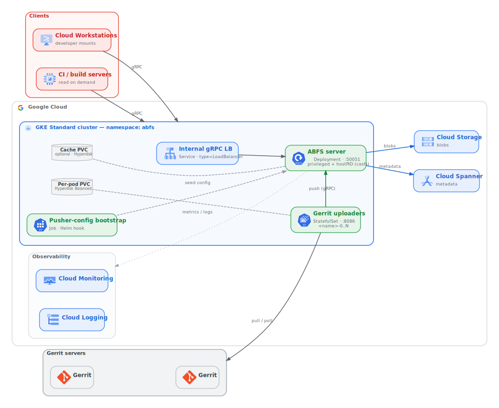

# Architecture

## Component overview

ABFS runs as Kubernetes workloads: the server and uploaders are pods, and the
kubelet, CSI, and managed GKE logging/monitoring provide node bootstrapping,
disk lifecycle, and observability.

## Workloads (Helm `chart/abfs`)

### ABFS server
- **Kind:** `Deployment`, `replicas: 1` (stateless against Spanner + GCS, so a single replica is sufficient).
- **Container:** the ABFS image; entrypoint unchanged. Args = the server `ABFS_CMD`
  flags (`--project … --bucket … --instance … --db …`); env = `RUN_MODE=server`,
  `NEEDS_GIT=false` (from a ConfigMap).
- **securityContext:** `privileged: true` (== `--privileged --cap-add=all`),
  pod `hostPID: true` (== `--pid=host`). Relies on the `casfs` kernel module being
  loaded on the node — from the node image (default) or the interim
  `abfs-casfs-installer` DaemonSet (see
  [What GKE handles natively](#what-gke-handles-natively)).
- **Port:** `50051` (gRPC).
- **Persistence:** none by default (the server attaches no data disk). An
  optional cache PVC is available behind a chart value (see
  [`05-configuration.md`](./05-configuration.md)).

### ABFS uploaders
- **Kind:** `StatefulSet`, `replicas: {{ uploader.count }}` (default 3).
- **Stable identity:** pods are `<name>-0..N`; a **headless Service** publishes
  them. These names must match the pusher-config entries (see below).
- **Storage:** `volumeClaimTemplates` → one `hyperdisk-balanced` PVC per pod
  (default 4Ti; Titanium nodes are Hyperdisk-only), mounted at `/abfs-storage`
  (== `DATADISK_MOUNTPOINT`). No custom disk format/fsck/mount logic is needed —
  the PD CSI driver + kubelet handle the data-disk lifecycle.
- **Container:** args = the uploader `ABFS_CMD` (`--tunnel-ports 0
  --remote-servers <server-svc>:50051 --lfs=<bool> … git-pusher --config
  config:git-pusher/default --storage-path /abfs-storage …`); env =
  `RUN_MODE=uploader`, `NEEDS_GIT=true`, `GIT_LFS_ENABLED=<bool>`. Privileged +
  hostPID like the server.
- **Pre-start hooks:** optional ConfigMap mounted at the hook path.

### Pusher-config bootstrap Job
- **Kind:** `Job`, run as a **Helm `post-install`/`post-upgrade` hook**.
- Renders the pusher config (from a templated ConfigMap), then runs `abfs init /
  cacheman run / cacheman ping / push / cacheman wait / put-ref` against the
  in-cluster server Service.
- Uploaders depend on it via a hook weight / init wait, so they start only after
  the bootstrap Job has seeded the pusher config.

## Traffic & exposure
- **In-cluster:** uploaders → server on `:50051` via the server's ClusterIP/DNS.
- **Out-of-cluster clients** (Workstations, CI): an **internal passthrough
  LoadBalancer** Service in front of the server (gRPC/TCP) is the entry point for
  external clients.
- **NetworkPolicy:** restricts ingress to the server (`:50051` from uploaders +
  the LB) and to uploaders (`:8086`), plus DNS egress. This scopes traffic
  between the workloads to exactly the ports each component needs.

## Storage
- **Durable state:** Spanner (metadata/"code") + GCS (blobs), provisioned via KCC.
- **Local cache:** uploader PVCs (per-pod). Server cache is ephemeral by default.

## Identity (node service account, not Workload Identity)
ABFS's license enforcement is GCE-VM-specific, so the data plane does **not** use
Workload Identity. The server and uploaders run on a dedicated `abfs-data` node
pool whose **node service account is the single licensed runtime SA** (`RUNTIME_SA`),
with the pool in **GCE-metadata mode** (`--workload-metadata=GCE_METADATA`, WI
bypassed for that pool only):
- Each pod's identity token is therefore a real **GCE VM identity token** for the
  runtime SA — carrying both the licensed SA email and the `google.compute_engine`
  claim ABFS's entitlement check requires (a claim Workload Identity tokens lack).
- The license is read from the node's `abfs-license` instance metadata
  (base64-encoded JSON), not a mounted Secret. See
  [`02-prerequisites-cluster-and-kcc.md` §1b](./02-prerequisites-cluster-and-kcc.md#1b-create-the-dedicated-abfs-node-pool).
- That SA's project roles (Spanner, GCS, Secret Manager, logging, monitoring) are
  granted as `IAMPolicyMember` resources in `infra/12`; it also needs Artifact
  Registry read on the image repo. The chart's KSAs carry no GSA annotation.

**Workload Identity stays enabled cluster-wide**, but only for Config Connector:
KCC's `cnrm-controller-manager` impersonates the `cnrm-system` GSA via WI. Do not
disable WI cluster-wide.

## What GKE handles natively
No custom node-bootstrap machinery is needed: the kubelet pulls and warms
container images, the PD CSI driver provisions and mounts data disks, GKE
managed logging ships container logs, and node-problem-detection is built into
GKE. ABFS pods run on the dedicated `abfs-data` node pool (see
[Identity](#identity-node-service-account-not-workload-identity)); node
provisioning and configuration are handled by GKE rather than per-node bootstrap
scripts.

The one node-level dependency is the **`casfs` kernel module**, which must be loaded
on each `abfs-data` node before ABFS can mount. Two modes are supported via the chart
value `casfs.provider`: **`image`** (default) takes casfs from the node image Google
ships going forward — nothing extra is deployed; **`daemonset`** (legacy, interim)
runs a gated `abfs-casfs-installer` DaemonSet on the `abfs-data` pool that loads a
Google-signed `casfs.ko` matched to each node's COS `BUILD_ID`, until casfs is in COS.
On COS the gate on loading out-of-tree modules is the **Loadpin** LSM (not Secure
Boot), so the legacy mode needs the pool to allow Google-signed modules
(`ENFORCE_SIGNED_MODULES`). Either way, ABFS pods gate on the module being loaded via
a `wait-for-casfs` initContainer (chart value `casfs.requireReady`, default `true`).
See [`02-prerequisites-cluster-and-kcc.md` §1b](./02-prerequisites-cluster-and-kcc.md#1b-create-the-dedicated-abfs-node-pool).
