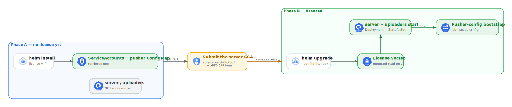

# Deployment runbook

Apply order matters: KCC infra first (it has internal dependencies), then the
two-phase licensing flow, then the Helm app. All `kubectl apply` commands target
the **existing** ABFS GKE cluster with KCC already installed (see
[`02-prerequisites-cluster-and-kcc.md`](./02-prerequisites-cluster-and-kcc.md)).

## 0. Set your instance values + render

Every project-specific value is a `REPLACE_<NAME>` token. Put the values in a
per-instance env file and render deployable manifests — the source tree stays
templated:

```bash
cp instances/example.env instances/<name>.env   # edit PROJECT_ID, NETWORK_NAME, etc.
scripts/render.sh instances/<name>.env               # -> rendered/<name>/
export RENDER=rendered/<name>
```

Every command below runs against `$RENDER/…`. For the CI/CD layer, also fill the
`infra/cicd/` tokens (AR/SSM/CWS regions, CA org/common-name, subnet, trigger id)
in your `.env`. A quick one-off can still fill placeholders in place
(`grep -rn 'REPLACE_' infra/ chart/`). Also tune `chart/abfs/values.yaml`
(`region`, `zone`, `image.repository`/`image.tag`, `uploader.count`, sizing, `nodeSelector`/`tolerations`)
to your cluster. See [Configuration](./05-configuration.md) for the full set of knobs.

## 0b. One-time cluster bootstrap (Config Connector + StorageClass)

Run once per cluster, after the cluster exists. Full KCC install details (operator
bundle, `cnrm-system` service account, IAM bindings incl. `roles/monitoring.metricWriter`)
are in [`02-prerequisites-cluster-and-kcc.md`](./02-prerequisites-cluster-and-kcc.md).

```bash
# Config Connector operator CRs (namespaced mode) + per-namespace identity binding:
kubectl apply -f infra/setup/configconnector.yaml
kubectl apply -f infra/00-namespace.yaml
kubectl apply -f infra/setup/configconnectorcontext.yaml

# Hyperdisk Balanced StorageClass (uploader PVCs):
kubectl apply -f infra/setup/storageclass-hyperdisk-balanced.yaml
```

> The ABFS workloads run on the dedicated `abfs-data` node pool, not an
> auto-provisioned ComputeClass. Create that pool once per cluster — see
> [`02-prerequisites-cluster-and-kcc.md` §1b](./02-prerequisites-cluster-and-kcc.md#1b-create-the-dedicated-abfs-node-pool).

## 1. Enable APIs + base infra

```bash
kubectl apply -f infra/00-namespace.yaml
kubectl apply -f infra/01-services.yaml          # serviceusage Services (API enablement)
# wait for services to reconcile
kubectl wait --for=condition=Ready -n abfs service.serviceusage.cnrm.cloud.google.com --all --timeout=10m
```

## 2. Identity, data backends, networking

```bash
kubectl apply -f infra/10-iam-service-accounts.yaml
kubectl apply -f infra/12-iam-project-roles.yaml   # binds all runtime roles to the single RUNTIME_SA
kubectl apply -f infra/20-spanner.yaml           # instance + database (schema in spec.ddl when CREATE_TABLES=true)
kubectl apply -f infra/21-storage.yaml
kubectl apply -f infra/22-secretmanager.yaml
kubectl apply -f infra/30-network-firewall.yaml
kubectl apply -f infra/31-dns.yaml
kubectl wait --for=condition=Ready -n abfs spannerinstance/abfs spannerdatabase/abfs storagebucket --all --timeout=15m
```

## 3. (Optional) CI/CD foundation

```bash
kubectl apply -f infra/cicd/        # SSM, Artifact Registry, Private CA, Cloud Build, Scheduler, Workstations
```
This layer is independent of the ABFS data plane and can be applied later. See
[`06-cicd-foundation.md`](./06-cicd-foundation.md) for ordering caveats (Private CA
before SSM private instance; SSM repo clone before the first Cloud Build).

## 4. Two-phase licensing

ABFS validates its license against the Google service account it runs as — that SA
must be listed in the license's `allowed_service_accounts`. On GKE the data plane
runs as a single **runtime SA** that is also the `abfs-data` node pool's service
account, and the license is delivered through **node instance metadata** (not a
Kubernetes Secret). Decide the runtime identity *before* requesting the license
(see [Runtime service account](./05-configuration.md#runtime-service-account-license-identity)).



> The license now lives in node metadata on the `abfs-data` pool, not in a Helm
> Secret — see [`02-prerequisites-cluster-and-kcc.md` §1b](./02-prerequisites-cluster-and-kcc.md#1b-create-the-dedicated-abfs-node-pool).

**Phase A — provision, get the SA, request the license:**

Apply `infra/` (KCC) as above, then print the runtime SA to submit in the EAP form:
```bash
# RUNTIME_SA is created by infra/10 when CREATE_RUNTIME_SAS=true, else it is your
# pre-existing SA. The worked example uses abfs-sa.
echo "${RUNTIME_SA}@PROJECT_ID.iam.gserviceaccount.com"
```
Install the chart gated off — only the bootstrap (ServiceAccounts + pusher
ConfigMap) renders; the server/uploaders are held until you flip `licensed=true`:
```bash
helm install abfs ./chart/abfs -n abfs -f chart/abfs/values.yaml \
  --set licensed=false
```

**When the license arrives — create the licensed `abfs-data` node pool:**

The license is not a Helm value; base64-encode it and put it in the node pool's
`abfs-license` metadata, with the node SA set to the runtime SA:
```bash
base64 -w0 abfs-license.json > abfs-license.b64
# Create the dedicated pool with the license metadata + runtime SA. Full command and
# flags: 02-prerequisites-cluster-and-kcc.md §1b.
gcloud container node-pools create abfs-data \
  --cluster CLUSTER --region REGION --project PROJECT_ID \
  --service-account RUNTIME_SA@PROJECT_ID.iam.gserviceaccount.com \
  --workload-metadata=GCE_METADATA \
  --metadata-from-file abfs-license=./abfs-license.b64 \
  ...   # remaining flags per docs/02 §1b
```
License rotation = update the node-pool `abfs-license` metadata and recreate/roll the
pool's nodes.

**Phase B — start ABFS:**
```bash
helm upgrade abfs ./chart/abfs -n abfs -f chart/abfs/values.yaml \
  --set licensed=true
```
This scales up the server + uploaders onto the `abfs-data` pool and runs the
pusher-config bootstrap Job (Helm post-install/upgrade hook). The pods read the
license from node metadata and present a GCE VM identity token for the runtime SA, so
the license checks pass with no Secret and no Workload Identity for the data plane.

Two data-plane details that make this work end to end (both are chart defaults — no
action needed, but worth knowing if you debug the handshake or pod scheduling):

- **Clients talk plaintext to the server.** The ABFS server serves PLAINTEXT gRPC
  with no client auth, but ABFS clients default to TLS. The chart sets
  `client.tls: false` (→ clients pass `--disable-tls=true`) and
  `client.authType: none` (→ `--auth-type none`) so the in-cluster uploader and the
  pusher-config bootstrap Job reach the server. Set `client.tls: true` only if you
  front the server with TLS. See [Configuration](./05-configuration.md#abfs-client-transport).
- **The pusher-config bootstrap Job is privileged + `hostPID`.** It runs
  `abfs cacheman`, which mounts the casfs cache, so it is *not* a plain hardened
  client — like the server/uploaders it gates on the `casfs` module being loaded on
  the `abfs-data` node (`casfs.requireReady`).

## 5. Schema (applied declaratively at deploy)

Per [`03-spanner-schema-ownership.md`](./03-spanner-schema-ownership.md), the ABFS
server does **not** create or migrate the Spanner schema at runtime — the deploy
applies it, exactly as the Terraform module does. The schema is bundled at
[`infra/schemas/0.0.31-schema.sql`](../infra/schemas/0.0.31-schema.sql) and
mirrored into `infra/20-spanner.yaml` as `SpannerDatabase.spec.ddl`, gated by the
instance-env toggle `CREATE_TABLES` (mirrors Terraform's
`abfs_spanner_database_create_tables`):

- **`CREATE_TABLES=true`** (the worked example) — `render.sh` keeps `spec.ddl`, so
  the `kubectl apply -f infra/20-spanner.yaml` in step 2 above creates the database
  **and** applies the schema. Nothing more to do here.
- **`CREATE_TABLES != true`** — `render.sh` blanks the ddl (`ddl: []`) and KCC
  creates an empty shell; apply the schema out-of-band:

  ```bash
  gcloud spanner databases ddl update abfs \
    --instance=abfs --project=PROJECT_ID \
    --ddl-file=infra/schemas/0.0.31-schema.sql
  ```

**Do not edit `spec.ddl` after the first apply** (risk of data loss) — it is the
KCC equivalent of Terraform's `ignore_changes = [ddl]`. If you run a newer ABFS
whose schema differs, bump the bundled `infra/schemas/<ver>-schema.sql` (see
[`03-spanner-schema-ownership.md`](./03-spanner-schema-ownership.md#schema-versioning)).

## 6. Verify

```bash
kubectl get spannerinstance,spannerdatabase,storagebucket,iamserviceaccount -n abfs
kubectl get pods -n abfs -o wide               # server/uploader pods land on abfs-data nodes
kubectl get svc -n abfs abfs-server            # internal LB IP for clients
kubectl logs -n abfs job/abfs-pusher-config    # bootstrap result
# Server licensing succeeded when its logs show all three:
kubectl logs -n abfs deploy/abfs-server | grep -E \
  'License signature verified|project number .* is authorized|server listening .* serving'
```

If anything fails to reconcile or a pod stays unscheduled, see
[Troubleshooting](./07-troubleshooting.md).

## Teardown order (reverse)

```bash
helm uninstall abfs -n abfs
kubectl delete -f infra/cicd/
kubectl delete -f infra/31-dns.yaml -f infra/30-network-firewall.yaml \
  -f infra/22-secretmanager.yaml -f infra/21-storage.yaml -f infra/20-spanner.yaml \
  -f infra/12-iam-project-roles.yaml -f infra/10-iam-service-accounts.yaml
# The dedicated abfs-data node pool is created out-of-band (docs/02 §1b); delete it
# separately: gcloud container node-pools delete abfs-data --cluster CLUSTER --region REGION
# Note: resources annotated deletion-policy: abandon (Spanner DB, service SAs,
# Private CA) are intentionally NOT destroyed — they protect data / the license SA.
```
