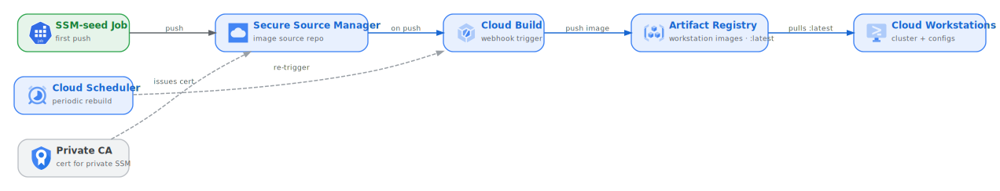

# Cloud Workstations CI/CD foundation on KCC

`infra/cicd/` provides a Cloud Workstations CI/CD foundation for the developer
environment, implemented entirely as Config Connector resources. It follows the
open-source `cicd-foundation` building block
(`github.com/GoogleCloudPlatform/cicd-foundation`), expressed here as KCC
manifests.

## What the foundation does

A GitOps pipeline that builds and periodically rebuilds custom Cloud Workstations
images (Android Studio, ASfP, CodeOSS):

1. **Secure Source Manager (SSM)** repo hosts the image source, optionally
   seeded from a configurable upstream git URL `SSM_CLONE_URL` (default the
   `horizon-sdv` repo).
2. **Cloud Build trigger** (webhook on push to the SSM repo) builds the
   Dockerfiles and pushes to **Artifact Registry**, tagged `:latest`.
3. **Cloud Scheduler** periodically re-triggers the build (security patching).
4. **Cloud Workstations** cluster + configs reference the `:latest` images.
5. For a **private** SSM instance, a **Private CA** pool/CA issues the instance
   cert.

## KCC resources (files in `infra/cicd/`)

| File | Resources |
|------|-----------|
| `40-artifact-registry.yaml` | `ArtifactRegistryRepository` (DOCKER) |
| `41-secure-source-manager.yaml` | `SecureSourceManagerInstance` (+ `kmsKeyRef`/`privateConfig` optional), `SecureSourceManagerRepository` (`initialConfig`) |
| `42-privateca.yaml` | `PrivateCACAPool` (ENTERPRISE), `PrivateCACertificateAuthority` (SELF_SIGNED) |
| `43-cloud-build.yaml` | `CloudBuildWorkerPool` (private pool, optional peered network for VPC-SC), `CloudBuildTrigger` (webhook/SSM source) |
| `44-cloud-scheduler.yaml` | `CloudSchedulerJob` (one per custom image, on its `ci_schedule`) |
| `45-workstations.yaml` | `WorkstationCluster`, `WorkstationConfig` (one per workstation config) |
| `46-cicd-iam.yaml` | `IAMServiceAccount` (cloudbuild, scheduler, cws-runner) + `IAMPolicyMember` incl. workstation creator/user |
| `47-monitoring.yaml` | `MonitoringNotificationChannel` (email) + `MonitoringAlertPolicy` (OOM, PromQL) |
| `48-ssm-seed-job.yaml` | Kubernetes `Job` — seeds the SSM repo from the upstream source |

## Operational setup: finishing the CI/CD wiring

The manifests in `infra/cicd/` are ready to deploy: one
`CloudBuildTrigger` + `CloudSchedulerJob` and one `WorkstationConfig` per custom
image (android-studio, android-studio-for-platform, code-oss), the email + OOM
monitoring, and an SSM-seed Job. A handful of
values are either server-assigned (available only after the first reconcile) or
organization-specific; supply them through the `REPLACE_*` tokens in your instance
`.env`. Complete the following steps to finish wiring the pipeline:

1. **Seed the SSM repo.** `SecureSourceManagerRepository` cannot clone a URL on
   its own. Apply `41-`, read the repo's `status.observedState.uris.gitHTTPS`
   into `REPLACE_SSM_REPO_URL`, then run `48-ssm-seed-job.yaml`, which clones the
   upstream `horizon-sdv` source and pushes it. That first push is what the build
   consumes.
2. **Populate the webhook secret.** KCC creates the `abfs-cicd-webhook` Secret
   container; add a version out of band
   (`gcloud secrets versions add abfs-cicd-webhook --data-file=-`) and point the
   SSM push webhook at the triggers.
3. **Fill in the runtime trigger IDs.** After `43-` reconciles, copy each
   trigger's id into `REPLACE_*_TRIGGER_ID` so the schedulers (`44-`) can call
   the `:run` endpoint.
4. **Set the organization-specific values.** `CWS_CREATOR`/`CWS_USER`
   (workstation IAM), `ALERT_EMAIL`, and — for a private SSM instance only —
   `CA_ORGANIZATION`/`CA_COMMON_NAME`.
5. **Add GPU boost configs out of band.** GPU boost has no field in the KCC
   `WorkstationConfig` CRD; add it via gcloud or the console after apply (flagged
   inline in `45-workstations.yaml`).
6. **(Optional) Add Binary Authorization / Kritis.** This is out of scope for the
   foundation; add a `BinaryAuthorizationPolicy`/`Attestor` if your environment
   requires attestation.
7. **Apply in the right order.** For a private SSM instance, apply
   `42-privateca.yaml` first. `infra/cicd/` is independent of the ABFS data plane,
   so you can defer it until the data plane is running.

Once the SSM repo is seeded with the `horizon-sdv` source and the webhook secret,
trigger IDs, and organization-specific values are in place, the pipeline builds
and periodically rebuilds the workstation images end to end in your project. For
help diagnosing reconcile or build failures, see
[`07-troubleshooting.md`](./07-troubleshooting.md).
