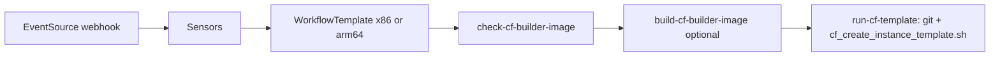

<!-- Copyright (c) 2026 Accenture, All Rights Reserved.

Licensed under the Apache License, Version 2.0 (the "License");
you may not use this file except in compliance with the License.
You may obtain a copy of the License at

        http://www.apache.org/licenses/LICENSE-2.0

Unless required by applicable law or agreed to in writing, software
distributed under the License is distributed on an "AS IS" BASIS,
WITHOUT WARRANTIES OR CONDITIONS OF ANY KIND, either express or implied.
See the License for the specific language governing permissions and
limitations under the License. -->

# Cuttlefish instance template (Helm)

Helm chart for **Argo WorkflowTemplates** that build or refresh **Cuttlefish Google Compute Engine (GCE)** instance templates (Packer + `cf_create_instance_template.sh`), plus **Argo Events Sensors** on the shared webhook / workflow-dispatch EventSource.

Deploy through **Module Manager** child Application **`workloads-android`** (`gitops/modules/workloads-android`), same pattern as **aaos-builder**.

## What’s in this chart

- `Chart.yaml` — chart metadata
- `values.yaml` — defaults (cloud, repo, mutex, **identity and access management (IAM)**, builder image)
- `values-local.yaml` — local `helm template` overrides
- `templates/workflow/workflowtemplates.yaml` — **x86** and **arm64** WorkflowTemplates + directed acyclic graph (**DAG**) wiring
- `templates/workflow/sensors.yaml` — Sensors for webhook / workflow-dispatch
- `templates/workflow/_check-cf-builder-image.tpl` — Artifact Registry tag check (aaos-builder parity)
- `templates/kcc/*.yaml` — optional **Config Connector (KCC)** context / **role-based access control (RBAC)** / **PreDelete Job** (when KCC publishing is enabled)
- `templates/_helpers.tpl` — shared Helm helpers
- `files/refresh_authorized_keys.sh` — supporting script asset

## Workflow profiles

| Template | OS / arch | Notes |
|----------|-------------|--------|
| `cf-instance-template-x86` | Debian x86_64 | Matches `job.groovy` defaults (no workflow `NETWORK` / `SUBNET`; script defaults apply) |
| `cf-instance-template-arm64` | Ubuntu ARM64 | Matches `job_arm.groovy`: **`subnet`**, **`region`**, **`zone`** → **`SUBNET`** / **`REGION`** / **`ZONE`**; default **`nic-type=IDPF`** |

**ARM64 Packer IAP / SSH timeouts**

- Image bakes use IAP-tunneled SSH (`packerUseIap`; arm64 profile defaults in `values.yaml`: **`packerSshTimeout: 15m`**, **`packerIapTunnelLaunchWait: 300`**).
- **`c4a-*-metal`** capacity and time-to-SSH **vary by region and zone** — some zones are consistently slower; a timeout that works in one zone may fail in another.
- If IAP or SSH wait failures persist after raising those Helm values:
  - Update **`arm64_region`**, **`arm64_zone`**, and related **`arm64_*`** in **`terraform/env/terraform.tfvars`** (when using a dedicated subnet).
  - Run **`terraform apply`**, then sync **`workloads-android`** (Module Manager / GitOps) so **`ARM64_REGION`** / **`ARM64_ZONE`** match.
  - Re-run **`cf-instance-template-arm64`**.
- See also [upgrade guide — ARM64 placement](../../../../../../docs/guides/upgrade_guide_4_0_0_to_4_1_0.md#section-2b---arm64-cuttlefish-placement) and **`docs/workloads/android/environment/cf_instance_template.md`**.

Both expose workflow parameters such as **`delete`**, **`forceImageBuild`**, and **Compatibility Test Suite (CTS)** Android URL fields (mapped to **`CTS_ANDROID_*_URL`** for the script). Non-empty URLs bake CTS under **`/opt/android-cts_<ver>/android-cts/`** on the image (see **`cf_host_initialise.sh`**); CTS/CVD test workflows expect that layout at runtime.

**Google Cloud Ops Agent** is installed on both profiles during **`cf_host_initialise.sh`** (journald receiver). Rebuild instance templates after changing Ops Agent config. **ARM64** ephemeral CVD/CTS workflows use **Cloud Logging** for live guest logs; **x86** defaults to serial port 2 ([cvd_argo_gce/README.md](../../../tests/cvd_argo_gce/README.md)).

## Flow (high level)



- **Sensors** translate HTTP / dispatch payloads into **`Workflow`** submits. Mappings are defined in **`values.yaml`** → **`webhookWorkflowParameters`** and applied by parameter **name** (not array index), so reordering WorkflowTemplate parameters does not break webhooks.
- **`run-cf-template`** checks out the pipeline repo to **`/workspace`** via an **input git artifact** (not DAG `arguments.artifacts` alone).

## IAM

**Identity and access management (IAM)** for workflow pods is controlled by **`spec.useElevatedWorkflowIam`** and **`spec.serviceAccountName`** (see `values.yaml`).

- Default **`spec.useElevatedWorkflowIam: true`** → pods use **`workflow-executor-elevated`** (Terraform **`gke-argo-workflows-elevated-sa`**) for **Packer / gcloud Compute**.
- Set **`false`** only if you extend the non-elevated **`gke-argo-workflows-sa`** instead.

Those **service accounts (SAs)** are also the in-cluster identity for **`kubectl`** against **`ComputeInstanceTemplate`** when the pipeline runs as an Argo Workflow: **`gitops/templates/argo-workflows-init.yaml`** grants **`workflow-executor`** / **`workflow-executor-elevated`** the needed **custom resource definition (CRD)** verbs in **`{namespacePrefix}workflows`** (**Role** + **ClusterRole**). That is **separate** from **`kcc.instanceTemplates.publisherIdentity`**, which only configures the **subject** of this chart’s **`cuttlefish-kcc-publisher`** **RoleBinding**—typically **`jenkins-sa`** in **`{namespacePrefix}jenkins`** so **Jenkins Kubernetes agents** (same script, different pod identity) can publish without duplicating the workflow pod SA. Do not confuse **`publisherIdentity.serviceAccountName`** with **`spec.serviceAccountName`** / **`useElevatedWorkflowIam`**.

## Builder image (`check-cf-builder-image` / `build-cf-builder-image`)

Same pattern as **aaos-builder**: a **`cloud-sdk:slim`** script lists Artifact Registry tags (avoids **`images describe`** + Container Analysis **`PERMISSION_DENIED`** on many WIs). If the tag is missing, the check fails, or **`forceImageBuild`** is true, the DAG runs **`templateRef`** to **`aaos-builder-runtime-image`** / **`build-defaults`**. Requires that WorkflowTemplate from the **docker_image_template** chart (deployed with **workloads-android**). **`spec.builderImageTag`** defaults to **`argowf-latest`**.

## Concurrency

- Both WorkflowTemplates use the **same** **`spec.synchronization.mutex.name`** (`cfInstanceTemplateConcurrencyMutexName`) so **x86 and arm64 Cuttlefish runs cannot overlap** (only one workflow at a time across profiles).
- Set **`cfInstanceTemplateConcurrencyMutexName: ""`** to disable the mutex (not recommended if both profiles are exposed).

## KCC uninstall (Argo prune / Module Manager disable)

Pipeline-applied **`ComputeInstanceTemplate`** **custom resources (CRs)** are labeled **`horizon-sdv.io/cuttlefish-kcc-template=true`**. On chart prune, Argo runs a **PreDelete** **`Job`** (`cuttlefish-cnrm-presdelete-hook.yaml`) that **`kubectl delete`s** labeled CRs, then any remaining names **`cf-it-*`**, then **`kubectl delete … --all`** for that **custom resource definition (CRD)** in the workflows namespace **before** **`ConfigConnectorContext`** prunes, so **Config Connector (KCC)** can finalize **`ConfigConnectorContext` (CCC)** teardown without manual cleanup. The Job sets **`argocd.argoproj.io/hook-timeout: "1200"`** for slow KCC deletes.

**Publisher RBAC:** Argo prunes **reverse sync-wave order** (RoleBinding before Role); we avoid **`PrunePropagationPolicy=foreground`** on the child **`workloads-android`** Application because stacking it with per-resource foreground was associated with **`resources-finalizer`** **`DeletionError`** after the Role was already removed. The **`RoleBinding`** subject namespace defaults to **`namespacePrefix + "jenkins"`** when `kcc.instanceTemplates.publisherIdentity.namespace` is unset, so sub-environments bind the configured **`serviceAccountName`** (default **`jenkins-sa`**) in **`sdv-jenkins`** (etc.), not the bare **`jenkins`** namespace. How this differs from Argo **`workflow-executor*`** RBAC is spelled out under **IAM** above and in **`docs/workloads/android/environment/cf_instance_template.md`** (section **KCC RBAC: Argo workflow pods vs `publisherIdentity`**).

**Values rename (from older charts / forks):** replace **`kcc.instanceTemplates.publisherServiceAccount`** (`namespace`, **`name`**) with **`kcc.instanceTemplates.publisherIdentity`** (`namespace`, **`serviceAccountName`**). The Helm helper **`cf-instance-template.publisherJenkinsNamespace`** was renamed to **`cf-instance-template.publisherIdentityNamespace`**.

**When PreDelete does not run or CRs remain:** **Module Manager** (Portal disable) clears **`ComputeInstanceTemplate`** CRs and **`ConfigConnectorContext`** after the child Application is gone; see **`docs/workloads/android/environment/cf_instance_template.md`** (*Portal / Module Manager disable* and *Module disable vs Packer disks* — GCP templates vs **Packer** zonal disks). Chart RBAC: **`module-manager-cnrm-computeinstancetemplates`** **ClusterRole** (`get`/`list`/`delete`); deploy with the Module Manager image that includes that behavior.

## Deploy-time vs submit-time

**Fixed at sync (Helm / GitOps / `horizon-workflow-cloud-env`):**

- **Source control management (SCM)** method, pipeline git secret, repo URL / revision
- **`spec.defaultRunStage`** when **`delete`** is false
- **Primary GKE** (`config.region` / `config.zone`): `spec.cloudRegion` / `cloudZone` on the CF chart (Artifact Registry path); run-pod env **`CLOUD_REGION`** / **`CLOUD_ZONE`** from **`horizon-workflow-cloud-env`** (same as aaos-builder).
- **ARM64 Cuttlefish** (`config.arm64.*` from Terraform `arm64_*`): workflow parameters **`subnet`**, **`region`**, **`zone`** are literal **`Values.arm64`** on the CF Helm source (`application-workloads-android.yaml` passes **`config.arm64`**, not **`config.region`**). ARM64 run pods also read **`ARM64_REGION`** / **`ARM64_ZONE`** from the same ConfigMap; the script sets **`REGION`** / **`ZONE`** from workflow parameters before Packer. Chain: Terraform → **`module-manager.yaml`** → **`MODULE_CONFIG`** → sync **`mod-workloads-android`**. Portal/webhook submits do not override placement (not in `webhookWorkflowParameters`).

**Typical submit / webhook parameters:**

- **`delete`**, **`forceImageBuild`**, and the rest listed in **`webhookWorkflowParameters`** (see `values.yaml`)

## Local render

```bash
helm template cf-test workloads/android/pipelines/environment/cf_instance_template/helm \
  -f workloads/android/pipelines/environment/cf_instance_template/helm/values-local.yaml
```

## See also

- User-facing CF template doc: `docs/workloads/android/environment/cf_instance_template.md`
- Jenkins jobs: `workloads/android/pipelines/environment/cf_instance_template/groovy/`
